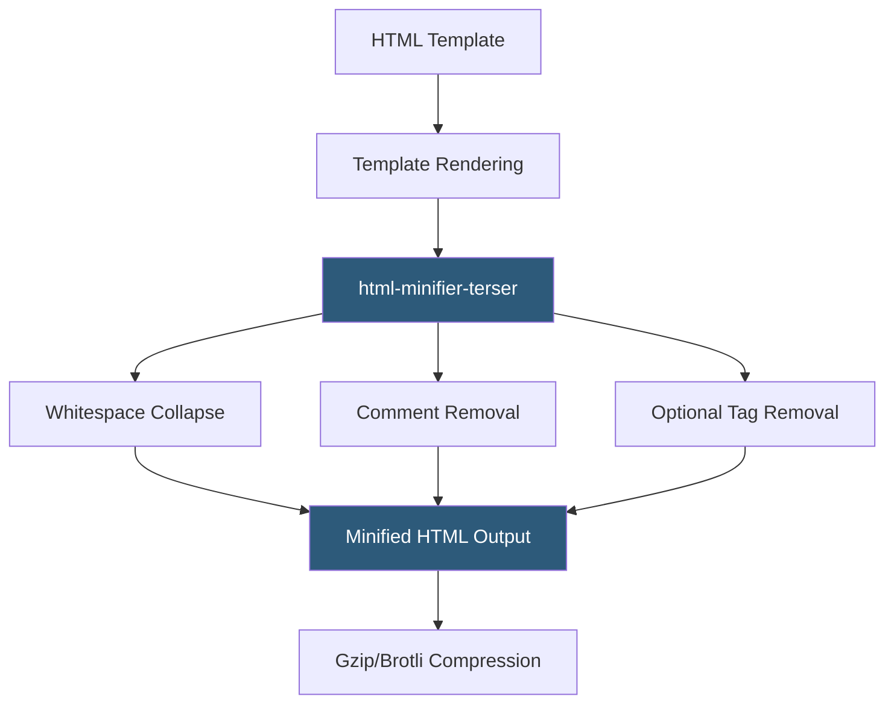

**Category:** Performance Optimization
**Difficulty:** Beginner
**Reading time:** 5 min read

---

HTML minification removes whitespace, comments, optional end tags, and other unnecessary characters from HTML documents to reduce their byte size. While HTML files are rarely the largest resources on a page, the initial HTML document is the critical first response — it must arrive before the browser can discover and request any other resources. Reducing HTML document size improves Time to First Byte perception and reduces the data transferred for server-rendered pages with large HTML payloads.

- **HTML Minifier** — tools like `html-minifier-terser` that parse and optimize HTML documents as part of build pipelines
- **Whitespace Normalization** — collapsing multiple spaces/newlines to single spaces or eliminating them entirely between block elements
- **Comment Removal** — stripping HTML comments (`<!-- -->`) that serve no runtime purpose
- **Optional Tag Removal** — HTML5 allows many closing tags to be omitted (e.g., `</li>`, `</td>`, `</option>`) without changing document parsing
- **Attribute Quoting** — removing quotes from attribute values that don't require them (`class="button"` → `class=button`)
- **Boolean Attributes** — simplifying boolean HTML attributes (`disabled="disabled"` → `disabled`)
- **Inline Script/Style Minification** — minifying JavaScript within `<script>` tags and CSS within `<style>` tags as part of HTML processing
- **Conditional Comments** — IE-specific conditional comments that can be removed in modern builds targeting current browsers only



HTML minification is applied either at build time for static sites or dynamically by middleware for server-rendered applications. The `html-minifier-terser` package (a maintained fork of the original html-minifier) is the standard tool, configurable with options controlling which optimizations to apply:

```javascript
const minified = minify(html, {
  collapseWhitespace: true,
  removeComments: true,
  removeOptionalTags: true,
  minifyCSS: true,
  minifyJS: true
});
```

Static site generators (Next.js, Gatsby, Astro) apply HTML minification automatically during production builds. For server-rendered Node.js applications, middleware can minify responses before sending them to clients, though this adds per-request processing overhead.

The impact of HTML minification varies significantly by page type. A simple marketing page with clean markup might see 5–15% size reduction. A complex server-rendered application page with extensive whitespace from template indentation and many HTML comments can see 20–40% reduction.

The Gzip compression algorithm excels at compressing HTML because HTML contains highly repetitive patterns (tags, attribute names, class names). This means minification and compression are complementary: minification removes explicit redundancy, then Gzip compresses remaining repetition. A well-minified HTML file compressed with Brotli can be 85–95% smaller than the uncompressed source.

For single-page applications where the initial HTML is a small shell loading JavaScript bundles, HTML minification provides minimal benefit — the SPA pattern shifts page content from HTML to JavaScript.

- Large server-rendered web applications generating substantial HTML per request
- E-commerce sites with complex product page templates
- Static site generators building thousands of HTML files from templates
- Content management systems generating long-form HTML for article pages
- Sites serving HTML to users on metered mobile data plans

| Advantage | Disadvantage |
|-----------|--------------|
| Reduces initial document size, improving TTFB perception | Minified HTML is less readable for view-source debugging |
| Inline script/style minification achieves additional savings | Server-side minification adds per-request CPU overhead |
| Zero effect on browser rendering or JavaScript behavior | Aggressive optional tag removal can occasionally trigger parser edge cases |
| Compounds with Gzip/Brotli for maximum compression ratios | Benefit is modest for simple pages; ROI lower than JS or CSS minification |

- [CSS Minification](css-minification.md)
- [JavaScript Minification](javascript-minification.md)
- [Content Compression](content-compression.md)

---
*Part of the [Performance Optimization](index.md) category · [Back to Master Index](../../index.md)*
