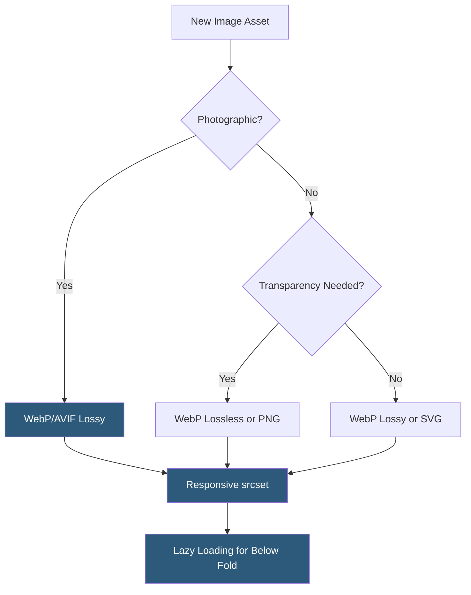

**Category:** Performance Optimization
**Difficulty:** Beginner
**Reading time:** 5 min read

---

Images typically constitute 50–70% of total page weight on modern websites, making image optimization one of the highest-impact performance improvements available. Effective image optimization combines format selection, compression, responsive delivery, and lazy loading to reduce bytes transferred while maintaining perceived visual quality. Modern formats like WebP and AVIF deliver dramatically smaller file sizes versus legacy JPEG and PNG formats at equivalent visual quality.

- **Lossy Compression** — image compression that permanently removes some image data to achieve smaller file sizes; JPEG and WebP support lossy compression
- **Lossless Compression** — compression that reduces file size without any quality loss; PNG and WebP support lossless modes; achieves smaller savings than lossy
- **WebP** — Google's modern image format offering 25–34% smaller files than JPEG/PNG at equivalent quality, with both lossy and lossless modes
- **AVIF** — a newer format based on the AV1 video codec, achieving 50% smaller files than JPEG; excellent quality but slower to encode than WebP
- **Responsive Images (`srcset`)** — the HTML attribute that provides multiple image sources at different resolutions, letting the browser select the appropriate size
- **Lazy Loading** — deferring image downloads until the image is near the viewport, implemented via `loading="lazy"` attribute or Intersection Observer API
- **Image CDN** — a specialized CDN that transforms images on-the-fly (resize, compress, format-convert) based on URL parameters or request headers
- **Aspect Ratio Preservation** — setting explicit `width` and `height` attributes on images to prevent Cumulative Layout Shift while images load

Image optimization begins with format selection. Photographic images (product photos, hero images, blog thumbnails) should use WebP as the primary format with JPEG as a fallback for older browsers. SVGs are ideal for logos, icons, and illustrations because they scale infinitely without quality loss and are often smaller than raster equivalents.

Compression quality settings require calibration per image type. A quality of 75–85% in WebP is typically indistinguishable from the original to users while reducing file size by 50% or more. Tools like Squoosh, ImageMagick, and Sharp (Node.js) provide programmatic compression with quality control.

Responsive images are implemented via `srcset` and `sizes` attributes. The `srcset` attribute provides multiple image versions at different widths (e.g., 400w, 800w, 1200w), and the `sizes` attribute tells the browser the display width of the image at each viewport breakpoint. The browser combines this with the screen's pixel density to select the most appropriate source, ensuring a 375px-wide mobile screen doesn't download a 2400px image.

Image CDNs like Cloudinary, Imgix, and AWS CloudFront with Lambda@Edge transform images dynamically based on request parameters. A single master image at full resolution can serve appropriately sized and formatted versions to every device combination without pre-generating every variant.

Lazy loading with `loading="lazy"` is supported by all modern browsers and defers offscreen image loading until the user scrolls near them. Hero images and above-the-fold content should always be eagerly loaded with `loading="eager"` or no attribute to avoid delaying LCP.

- E-commerce product catalogs with thousands of images requiring automated optimization
- Blog platforms where editorial teams upload unoptimized images that need processing
- News sites with heavy image content targeting mobile users on cellular connections
- Web applications implementing image galleries or media-heavy dashboards
- Any site failing Google PageSpeed Insights due to "Properly size images" or "Serve images in next-gen formats" diagnostics

| Advantage | Disadvantage |
|-----------|--------------|
| WebP/AVIF reduce bandwidth costs significantly at CDN scale | AVIF encoding is computationally expensive; requires caching strategies |
| Responsive images eliminate wasted bandwidth on mobile | `srcset` implementation complexity increases with number of breakpoints |
| Lazy loading reduces initial page weight by 40–60% on image-heavy pages | Lazy loading below-fold images can cause layout shifts if dimensions aren't specified |
| Image CDNs eliminate manual resizing and format conversion work | Image CDN costs can be significant at high traffic volumes |

- [Page Load Time Optimization](page-load-time-optimization.md)
- [Lazy Loading Implementation](lazy-loading-implementation.md)
- [Content Compression](content-compression.md)

---
*Part of the [Performance Optimization](index.md) category · [Back to Master Index](../../index.md)*
