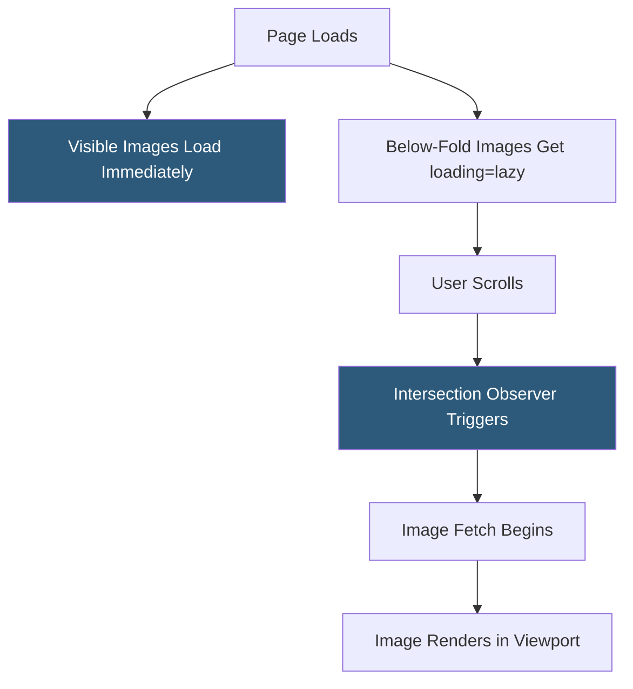

**Category:** Performance Optimization
**Difficulty:** Beginner
**Reading time:** 5 min read

---

Lazy loading is a performance pattern that delays loading of non-critical resources — images, videos, iframes, and JavaScript modules — until they are needed, typically when they approach the user's visible viewport while scrolling. By loading only what is immediately visible, lazy loading reduces initial page weight, decreases Time to Interactive (TTI), and improves perceived performance. Modern browsers support native lazy loading for images and iframes via the `loading="lazy"` attribute, requiring zero JavaScript.

- **Native Lazy Loading** — the browser-native `loading="lazy"` attribute on `` and `<iframe>` elements, supported in all modern browsers
- **Intersection Observer API** — a JavaScript API that efficiently detects when elements enter the viewport, used by custom and library-based lazy loading implementations
- **Loading Threshold** — the distance from the viewport at which lazy loading triggers; browsers calculate this based on connection speed and device type
- **Placeholder** — a low-resolution, blurred, or solid-color image shown while the full-resolution version loads, reducing layout shift
- **LCP Impact** — lazy loading must not be applied to above-the-fold images or LCP elements; doing so delays the most important render metrics
- **Code Splitting** — the JavaScript equivalent of lazy loading: splitting bundles so only code needed for the current view is loaded
- **Progressive Loading** — serving low-resolution images first, then progressively enhancing to full quality as more data loads
- **Below-the-Fold** — content that requires scrolling to reach; the primary candidate for lazy loading



The simplest lazy loading implementation requires a single HTML attribute: ``. The browser handles all detection and loading logic natively, determining the optimal distance threshold at which to begin fetching based on network conditions and scroll velocity.

For older browsers or more control, the Intersection Observer API provides the custom implementation path. An observer is registered on target elements, with a callback that fires when each element intersects the viewport threshold. The callback typically replaces a `data-src` attribute with `src`, triggering the actual resource load.

```javascript
const observer = new IntersectionObserver((entries) => {
  entries.forEach(entry => {
    if (entry.isIntersecting) {
      entry.target.src = entry.target.dataset.src;
      observer.unobserve(entry.target);
    }
  });
}, { rootMargin: '200px' });
document.querySelectorAll('img[data-src]').forEach(img => observer.observe(img));
```

JavaScript module lazy loading uses dynamic `import()` syntax: `const module = await import('./heavyComponent.js')`. Bundlers like Webpack and Vite automatically split code at dynamic import boundaries, creating separate chunks loaded only when needed.

Lazy loading iframes — particularly third-party embeds like YouTube videos, Google Maps, and social media widgets — provides significant performance gains since these embeds load entire third-party JavaScript environments.

- Image-heavy product listing pages where most images are below the fold
- Long-form article and blog pages with inline images throughout the content
- Single-page applications with feature-rich components not needed on initial load
- Pages with multiple third-party widget embeds (maps, videos, social feeds)
- E-commerce category pages with 50+ product images per page

| Advantage | Disadvantage |
|-----------|--------------|
| Native `loading="lazy"` requires zero JavaScript and is widely supported | Must not be applied to above-the-fold images; incorrectly applied, it worsens LCP |
| Reduces initial page weight significantly on image-heavy pages | Lazy-loaded images may cause layout shift if dimensions aren't specified with `width` and `height` attributes |
| Intersection Observer is highly performant with no scroll event overhead | Very fast scrollers may see images loading mid-viewport before they render |
| Dynamic import() enables granular JavaScript code splitting | Over-eager lazy loading of small images may add network overhead from many small requests |

- [Critical Rendering Path Optimization](critical-rendering-path-optimization.md)
- [Image Optimization Techniques](image-optimization-techniques.md)
- [Above-the-Fold Content Prioritization](above-the-fold-content-prioritization.md)

---
*Part of the [Performance Optimization](index.md) category · [Back to Master Index](../../index.md)*
