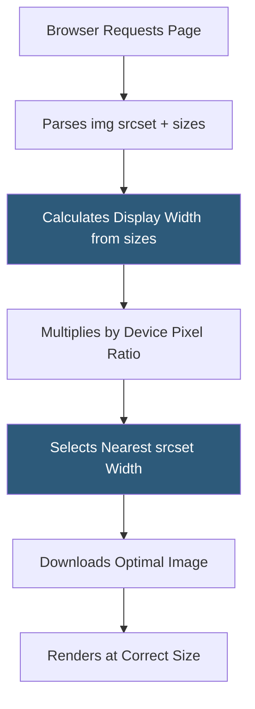

**Category:** Performance Optimization
**Difficulty:** Intermediate
**Reading time:** 6 min read

---

Responsive image delivery ensures that browsers download images sized appropriately for the device's screen resolution and viewport size, preventing mobile devices from downloading desktop-sized images and preventing high-DPI displays from receiving blurry low-resolution images. Using HTML's `srcset` and `sizes` attributes, browsers automatically select the optimal image variant from a set of candidates. Combined with modern image formats, responsive images can reduce bandwidth consumption by 50–80% for mobile visitors.

- **`srcset` attribute** — a list of image URLs with their intrinsic widths or pixel densities, allowing browsers to select the best candidate
- **`sizes` attribute** — specifies how wide the image will be rendered at different viewport sizes, enabling browsers to calculate the appropriate srcset entry
- **Device Pixel Ratio (DPR)** — the ratio of physical to logical pixels; a 2× DPR device needs double the resolution image to appear sharp
- **Art Direction** — serving different image crops or compositions based on viewport size using the `<picture>` element's `media` attributes
- **Width Descriptors** — `srcset` values specifying intrinsic image widths in pixels (e.g., `image-800w.jpg 800w`), used with a `sizes` declaration
- **Density Descriptors** — `srcset` values specifying pixel density (e.g., `image@2x.jpg 2x`), simpler but less flexible than width descriptors
- **Image CDN** — a service (Cloudinary, Imgix, Cloudflare Images) that dynamically generates and delivers appropriately sized images based on request parameters
- **Breakpoints** — the viewport widths at which layout changes require different image sizes, typically matching CSS media query breakpoints



The `srcset` + `sizes` combination gives browsers the information to make optimal image selections. Consider a product image:

```html

```

The `sizes` attribute tells the browser: on viewports under 600px, the image takes 100% of the viewport; on viewports under 1200px, it takes 50%; otherwise it's fixed at 800px. The browser multiplies the display width by the device pixel ratio to determine the needed resolution, then selects the smallest `srcset` entry that meets that need.

For a 375px wide mobile device with 2× DPR, the browser calculates it needs 750px of resolution and selects `product-800.webp` (the smallest that satisfies 750px). A desktop at 1440px viewport where the image is 50vw would calculate 720px × 1× = 720px, also selecting `product-800.webp`. Without responsive images, both would have downloaded the 1600w version.

Art direction handles cases where the image composition should change at different sizes — a team photo might show the full group on desktop but just the subject's face on mobile. The `<picture>` element with `media` attributes enables this:

```html
<picture>
  <source media="(max-width: 600px)" srcset="headshot.webp">
  
</picture>
```

Image CDNs like Cloudinary and Imgix automate the generation of all size variants from a single master image, with URL parameters specifying dimensions: `//res.cloudinary.com/demo/image/upload/w_800/product.jpg`.

- E-commerce sites serving product images to a mix of mobile and desktop shoppers
- News and media sites with article imagery consumed across devices
- Portfolio and photography sites where image quality is brand-critical
- Applications where mobile bandwidth cost is a user experience concern
- Any site where mobile traffic exceeds 40% of sessions

| Advantage | Disadvantage |
|-----------|--------------|
| Eliminates oversized image downloads; mobile users don't download desktop images | Requires generating and storing multiple image size variants |
| Browser-native selection logic without JavaScript | `sizes` attribute is complex to write correctly and must stay synchronized with CSS layout |
| Supports both DPR and layout-width optimization in one attribute pair | Legacy browsers ignore srcset and fall back to `src`, requiring a reasonable fallback |
| Combines with WebP/AVIF format delivery for maximum bandwidth savings | Without an image CDN, build processes must generate all variants for every image |

- [Image Optimization Techniques](image-optimization-techniques.md)
- [WebP and AVIF Formats](webp-and-avif-formats.md)
- [Lazy Loading Implementation](lazy-loading-implementation.md)

---
*Part of the [Performance Optimization](index.md) category · [Back to Master Index](../../index.md)*
