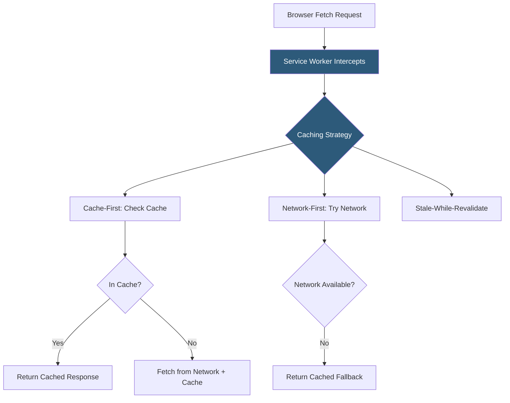

**Category:** Performance Optimization
**Difficulty:** Advanced
**Reading time:** 7 min read

---

Service workers are JavaScript scripts that run in a background thread separate from the main browser context, intercepting network requests and implementing custom caching strategies that go beyond what HTTP cache headers can achieve. They enable applications to serve content from local caches even when offline, provide instant cache-first responses for returning visitors, and implement sophisticated strategies like background sync. Service workers are the foundation of Progressive Web Apps (PWAs) and represent the most powerful client-side caching mechanism available on the web.

- **Service Worker** — a JavaScript worker registered by a web page that runs in a separate thread and intercepts network requests via the `fetch` event
- **Cache API** — a browser-native storage API for storing HTTP responses; service workers use it to build custom caches
- **Cache-First Strategy** — serve from cache immediately; fall back to network if not cached; fastest for static assets
- **Network-First Strategy** — attempt network request first; fall back to cache if offline; appropriate for dynamic content
- **Stale-While-Revalidate** — serve cached response immediately, then update cache from network in background
- **Cache-Then-Network** — serve cached version instantly and simultaneously fetch from network, updating UI when fresh data arrives
- **Workbox** — Google's library providing pre-built service worker caching strategies, reducing boilerplate significantly
- **Service Worker Lifecycle** — install, activate, and fetch phases; updates require users to close all tabs running the old worker



Service workers are registered from the main page and control requests from that page after installation. The lifecycle has three phases: install (pre-cache static assets), activate (clean up old caches), and fetch (intercept requests during normal operation).

During installation, the service worker pre-caches all static assets for the application shell:

```javascript
self.addEventListener('install', event => {
  event.waitUntil(
    caches.open('app-shell-v1').then(cache => 
      cache.addAll(['/index.html', '/main.js', '/styles.css', '/offline.html'])
    )
  );
});
```

During fetch events, the service worker intercepts all requests and applies its caching strategy. A cache-first strategy for static assets:

```javascript
self.addEventListener('fetch', event => {
  event.respondWith(
    caches.match(event.request).then(cached => {
      if (cached) return cached;
      return fetch(event.request).then(response => {
        caches.open('dynamic-v1').then(cache => cache.put(event.request, response.clone()));
        return response;
      });
    })
  );
});
```

Workbox simplifies this significantly:

```javascript
import { registerRoute } from 'workbox-routing';
import { CacheFirst, NetworkFirst } from 'workbox-strategies';

registerRoute(({ request }) => request.destination === 'image', new CacheFirst());
registerRoute(({ request }) => request.url.includes('/api/'), new NetworkFirst());
```

Service worker updates are batched until all tabs running the old worker are closed. The `skipWaiting()` and `clients.claim()` APIs force immediate activation, but this can cause version mismatches between old HTML and new assets. Careful versioning strategy is required.

- Progressive Web Apps requiring offline functionality for core features
- News and media apps where users want to read previously visited content without connectivity
- E-commerce apps wanting instant page loads for returning users via cached product pages
- Dashboard applications with expensive API calls that should serve cached data while refreshing
- Mobile web applications competing with native apps in perceived performance

| Advantage | Disadvantage |
|-----------|--------------|
| Enables genuinely offline functionality; unachievable with HTTP caching alone | Service worker lifecycle complexity introduces subtle update bugs if not managed carefully |
| Cache-first strategies provide sub-millisecond response times for cached resources | Debugging service workers is complex; requires Chrome DevTools service worker panel |
| Fine-grained per-URL caching strategies impossible with HTTP headers | Service worker cache storage has limits; old entries must be actively expired |
| Background sync enables deferred actions when connectivity returns | HTTPS required; cannot be used on HTTP sites |

- [Browser Caching Strategies](browser-caching-strategies.md)
- [Progressive Web App (PWA) Optimization](progressive-web-app-pwa-optimization.md)
- [Cache-Control Headers](cache-control-headers.md)

---
*Part of the [Performance Optimization](index.md) category · [Back to Master Index](../../index.md)*
