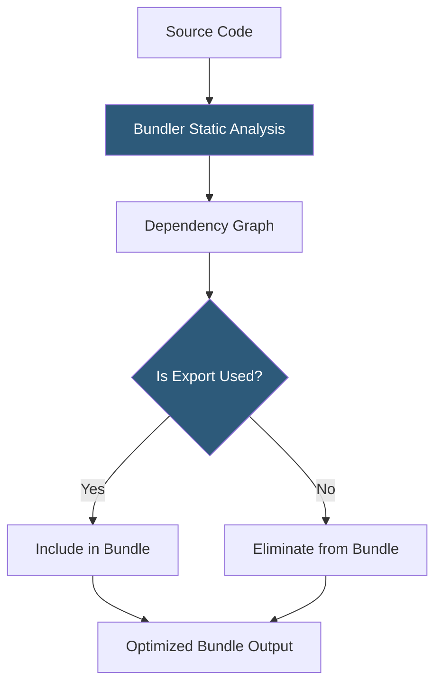

**Category:** Performance Optimization
**Difficulty:** Intermediate
**Reading time:** 6 min read

---

Tree shaking is a build-time optimization that eliminates unused JavaScript code (dead code) from the final bundle by analyzing which exports from modules are actually imported and used. The term "tree shaking" comes from the mental model of shaking a dependency tree to make dead leaves fall out. Modern JavaScript bundlers (Webpack, Rollup, Vite, esbuild) perform tree shaking automatically when projects use ES module syntax, eliminating code that is defined but never called.

- **ES Modules (ESM)** — the `import`/`export` syntax required for tree shaking; CommonJS (`require`) modules are not statically analyzable and cannot be reliably tree-shaken
- **Static Analysis** — the process of analyzing import/export relationships at build time without executing code; enables bundlers to determine which exports are used
- **Dead Code Elimination** — removing code paths, functions, and variables that are defined but never reachable during execution
- **Side Effects** — code that produces effects when a module is loaded (DOM manipulation, global mutations) independent of exports; modules with side effects cannot be fully tree-shaken
- **`sideEffects` field** — a `package.json` field that declares whether a package's files have side effects, enabling bundlers to eliminate unused imports safely
- **Named Exports vs Default Exports** — named exports are individually tree-shakeable; default exports export the entire module, making selective elimination harder
- **Bundle Analysis** — tools like webpack-bundle-analyzer and Vite's `rollup-plugin-visualizer` that visualize which modules contribute to bundle size
- **Rollup** — the bundler with the most reliable tree shaking, often used as the basis for library builds



Tree shaking operates during bundling by building a dependency graph of all `import` statements. When a module exports five functions but only two are imported elsewhere in the application, the bundler marks the three unused exports as dead code and excludes them from the output.

For tree shaking to work, the codebase must use ES module syntax:

```javascript
// Shakeable: only parseDate is used
import { parseDate } from 'date-utils';

// Not shakeable: requires the entire module
const dateUtils = require('date-utils');
```

When a utility library is written with named exports, tree shaking eliminates unused utilities. The classic example is Lodash: `import _ from 'lodash'` imports all ~70KB; `import { debounce } from 'lodash-es'` enables the bundler to include only the `debounce` function and its dependencies.

The `sideEffects: false` declaration in `package.json` tells bundlers that no module in the package has side effects, enabling aggressive elimination. Without it, bundlers must conservatively include all imported modules even if no exports are used. CSS imports from JavaScript (`import './styles.css'`) are side effects — the `sideEffects` field can list them: `"sideEffects": ["*.css"]`.

Bundle analyzers visualize the composition of output bundles as treemaps. Unexpectedly large chunks often reveal that a small component is transitively importing a heavy library that could be replaced or split. Running webpack-bundle-analyzer or `vite build --report` after significant dependency additions helps catch bloat early.

- Applications importing from large utility libraries (Lodash, date-fns, RxJS) where only a fraction of functions are used
- Component libraries where consumers import individual components rather than the full library
- Applications using large icon libraries where only a subset of icons appear in the UI
- Build optimization passes before major releases to identify and eliminate unused code
- Performance-critical applications where every kilobyte of JavaScript parse time matters

| Advantage | Disadvantage |
|-----------|--------------|
| Eliminates entire unused library subsections with no code changes | Requires ES module syntax throughout; CommonJS libraries are not tree-shakeable |
| Dramatic bundle size reductions when large libraries are partially used | Side effects prevent some tree shaking; third-party libraries may not declare `sideEffects` correctly |
| Build-time optimization with no runtime overhead | Dynamic imports and `require()` calls are opaque to static analysis |
| Combined with code splitting for maximum impact | Requires bundle analysis tooling to measure effectiveness |

- [Bundle Size Optimization](bundle-size-optimization.md)
- [Code Splitting Strategies](code-splitting-strategies.md)
- [JavaScript Minification](javascript-minification.md)

---
*Part of the [Performance Optimization](index.md) category · [Back to Master Index](../../index.md)*
