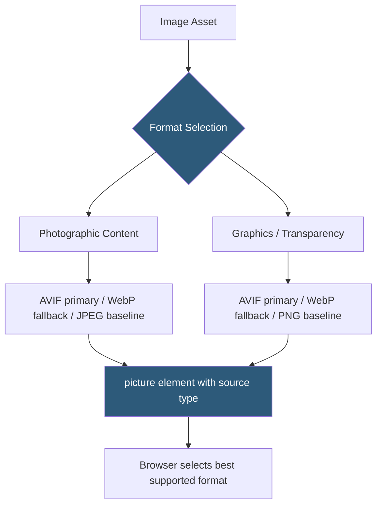

**Category:** Performance Optimization
**Difficulty:** Beginner
**Reading time:** 5 min read

---

WebP and AVIF are modern image formats that provide significantly better compression than JPEG and PNG while maintaining comparable visual quality, enabling web pages to deliver the same visual experience at substantially reduced file sizes. WebP, developed by Google, typically achieves 25–35% smaller file sizes than JPEG. AVIF, based on the AV1 video codec, achieves 50% or greater compression versus JPEG at equivalent quality levels. Both formats support transparency (like PNG) and are supported in all modern browsers.

- **Lossy Compression** — compression that removes some image data to achieve smaller files; both WebP and AVIF offer lossy modes
- **Lossless Compression** — compression that preserves all image data; WebP supports lossless, AVIF supports near-lossless
- **AVIF** — AV1 Image File Format, derived from the AV1 video codec, offering the best compression ratios of any widely-supported image format
- **WebP** — Google's image format offering better compression than JPEG/PNG with broad browser support since 2020
- **`<picture>` element** — HTML element enabling format negotiation, serving AVIF to browsers that support it with WebP and JPEG as fallbacks
- **Browser Support** — AVIF is supported in Chrome 85+, Firefox 93+, Safari 16+; WebP is supported in all modern browsers including Safari 14+
- **Encoding Time** — AVIF encoding is computationally intensive and slow; WebP encodes much faster
- **Alpha Channel** — both formats support transparency, allowing them to replace PNG in all use cases



Modern image delivery uses the `<picture>` element to serve the best supported format to each browser without JavaScript:

```html
<picture>
  <source srcset="image.avif" type="image/avif">
  <source srcset="image.webp" type="image/webp">
  
</picture>
```

The browser evaluates `<source>` elements top-to-bottom, selecting the first format it supports. AVIF-capable browsers (Chrome, Firefox, modern Safari) receive the smallest file. Browsers supporting only WebP receive the mid-tier. Legacy browsers fall through to the JPEG baseline.

CDN-based format negotiation automates this without HTML changes. CDNs like Cloudflare, Cloudinary, and Fastly inspect the `Accept` request header — browsers signal format support with values like `image/avif, image/webp, */*` — and serve the appropriate format from a single URL. This requires no changes to existing `` tags.

AVIF encoding requires more CPU time than WebP encoding — a large photo can take seconds to encode as AVIF versus milliseconds as WebP. Build pipelines should pre-generate AVIF versions at build time for static assets. For dynamic image processing, WebP is more practical due to its faster encoding.

Image quality settings (0–100) work differently between formats: AVIF quality 60 often looks equivalent to JPEG quality 80, so quality numbers are not directly comparable across formats. Visual comparison and SSIM (Structural Similarity Index) testing should guide quality selection.

- E-commerce product images where file size reduction directly improves load time and conversion
- News and media sites serving large volumes of photographic content
- Landing pages with full-width hero images where format optimization provides immediate wins
- Mobile-first web applications where bandwidth is constrained
- Any site running Google's PageSpeed Insights or Core Web Vitals audits targeting LCP improvements

| Advantage | Disadvantage |
|-----------|--------------|
| AVIF reduces file sizes 50%+ vs JPEG at equivalent quality | AVIF encoding is slow; computationally expensive for dynamic image processing |
| WebP has near-universal browser support with no fallback needed for modern users | Tooling and CMS support for AVIF still maturing compared to JPEG/PNG workflows |
| Both formats support transparency, fully replacing PNG use cases | Older browsers (IE11) require JPEG/PNG fallbacks |
| CDN format negotiation automates delivery without code changes | Quality tuning per format requires additional testing vs. familiar JPEG quality settings |

- [Image Optimization Techniques](image-optimization-techniques.md)
- [Responsive Image Delivery](responsive-image-delivery.md)
- [Lazy Loading Implementation](lazy-loading-implementation.md)

---
*Part of the [Performance Optimization](index.md) category · [Back to Master Index](../../index.md)*
