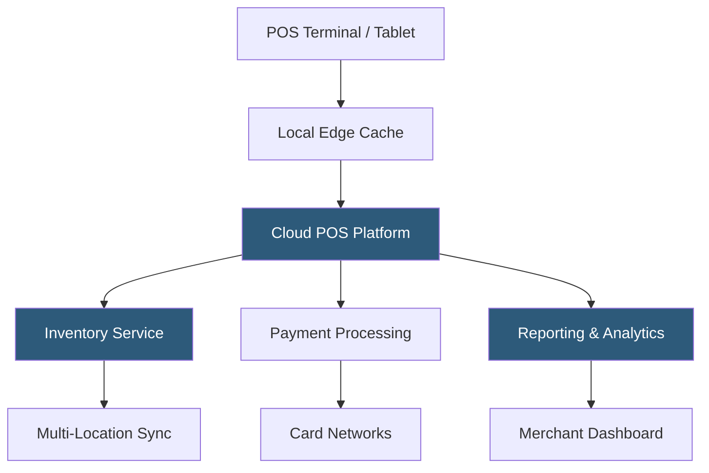

**Category:** Point of Sale (POS) Systems
**Difficulty:** Intermediate
**Reading time:** 6 min read

---

Cloud-based POS systems store all transaction data, inventory records, and configuration in remote servers accessible via the internet, replacing legacy on-premise systems that required local servers and manual software updates. This architecture enables real-time multi-location synchronization, remote management from any device, automatic updates without IT intervention, and seamless integration with the broader SaaS ecosystem. The shift from legacy POS to cloud POS represents the most significant transformation in retail and hospitality technology infrastructure in two decades.

- **SaaS POS** — POS software delivered as a service via subscription, with no on-premise server installation; updates push automatically to all terminals
- **Cloud Sync** — continuous or near-real-time synchronization of sales, inventory, and customer data to cloud servers, enabling cross-location visibility
- **API-First Architecture** — POS systems exposing RESTful APIs for integration with accounting software, ERP, loyalty platforms, and e-commerce systems
- **Offline Mode** — the capability to process transactions locally when internet connectivity is lost, queuing data for sync when reconnected
- **Multi-Tenant Infrastructure** — cloud POS platforms serving thousands of merchants from shared infrastructure, with logical data isolation per merchant
- **PCI DSS Compliance** — the Payment Card Industry Data Security Standard; cloud POS vendors maintain PCI compliance at the platform level, reducing the merchant's compliance scope
- **Headless POS** — an architecture separating POS business logic from the UI, allowing brands to build custom checkout interfaces backed by cloud POS APIs
- **Edge Caching** — local device caching of product catalog and pricing data to ensure POS remains functional during brief internet outages

Cloud POS systems operate on a distributed architecture where the POS application runs locally on a tablet or terminal but all persistent data is stored in cloud databases. When a cashier completes a sale, the transaction is sent to the cloud POS backend via HTTPS, updating inventory records, customer purchase history, and sales reports in real time. All locations sharing the same account see inventory and sales data from a unified view.

Most modern cloud POS systems implement an offline mode using local SQLite or device storage to continue processing transactions when connectivity is unavailable. The local queue stores transaction records, and when connectivity is restored, the system reconciles local transactions against the cloud database, applying conflict resolution rules (typically last-write-wins or manual review for inventory discrepancies).

Hardware in cloud POS systems is typically commodity iPads or Android tablets paired with purpose-built peripherals: card readers, receipt printers (connected via Bluetooth, USB, or LAN), cash drawers, and barcode scanners. The hardware connects to the cloud POS app installed from the App Store or Google Play.

Integration capabilities are cloud POS's greatest advantage over legacy systems. REST APIs published by major cloud POS vendors (Square, Shopify, Lightspeed, Clover) enable connections to accounting software, inventory management systems, loyalty platforms, and e-commerce backends. Data flows automatically between systems without manual export-import processes.

Software updates in cloud POS deploy automatically, often overnight without disrupting operations. Merchants always run the current version with the latest security patches, new features, and compliance updates — eliminating the upgrade cycle that plagued legacy systems.

- Retailers with multiple locations needing unified inventory management
- Restaurant groups wanting to manage menus across all locations from a central dashboard
- Businesses adopting an omnichannel strategy integrating in-store and online sales
- Merchants seeking to eliminate on-premise server maintenance overhead
- Franchise systems requiring consistent POS software across independently operated locations

| Advantage | Disadvantage |
|-----------|--------------|
| Automatic software updates eliminate manual upgrade cycles | Internet dependency creates business continuity risk without offline mode |
| Multi-location sync provides real-time inventory visibility | Ongoing subscription costs vs. one-time legacy POS license fees |
| API ecosystem enables integration with any SaaS tool | Data lives with vendor; migration complexity if switching platforms |
| Remote management reduces need for on-site IT support | Performance depends on internet connection quality and latency |

- [Square POS System](square-pos-system.md)
- [Shopify POS Integration](shopify-pos-integration.md)
- [POS Inventory Management](pos-inventory-management.md)

---
*Part of the [Point of Sale (POS) Systems](index.md) category · [Back to Master Index](../../index.md)*
