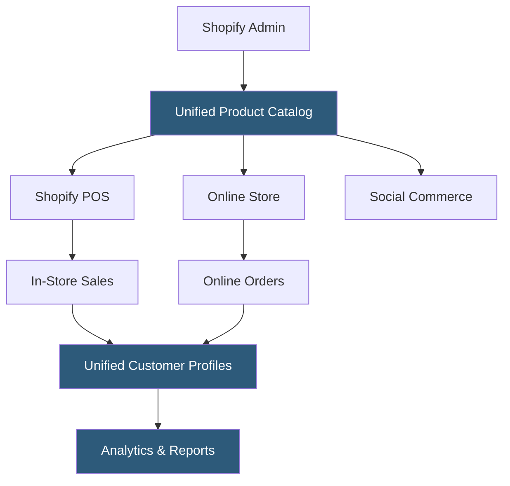

**Category:** Point of Sale (POS) Systems
**Difficulty:** Intermediate
**Reading time:** 6 min read

---

Shopify POS is the in-person retail component of the Shopify commerce platform, designed to unify online and physical store operations under a single inventory, customer, and reporting system. Unlike standalone POS systems, Shopify POS is built for merchants who already sell online via Shopify and want to eliminate the data silos between their e-commerce and physical retail operations. The platform synchronizes product catalogs, inventory levels, customer profiles, and order history in real time across channels.

- **Omnichannel Commerce** — the model of selling across multiple channels (online store, physical retail, social media) with unified inventory, customer data, and reporting
- **Shopify POS Go** — Shopify's proprietary all-in-one handheld POS hardware combining a barcode scanner, card reader, and Android POS software in one device
- **Buy Online, Pick Up In-Store (BOPIS)** — a fulfillment method where customers order on the Shopify online store and collect from a physical location, with POS used to process pickup
- **Ship-to-Customer from Store** — the ability for POS staff to fulfill online orders from in-store inventory, reducing warehouse dependency
- **Smart Grid** — Shopify POS's customizable app-style tile layout on the POS home screen for quick access to frequently used products and actions
- **Staff PINs** — individual employee login codes for tracking sales attribution, permissions, and end-of-shift reports
- **Local Pickup** — the fulfillment option where in-store staff receive and process customer pickup notifications directly in the POS interface
- **Tap to Pay on iPhone** — Apple's technology allowing Shopify merchants to accept contactless payments on a standard iPhone without additional hardware

Shopify POS operates as an iOS/Android application connecting to the central Shopify Admin, which serves as the single source of truth for all commerce operations. When a merchant adds a product in Shopify Admin, it immediately appears in both the online store and the POS item catalog. Inventory adjustments from POS sales update online store inventory in real time, preventing overselling.

At checkout, the POS app presents a cart builder where staff can search products by name, barcode scan, or browse categories. Discounts, gift cards, and loyalty rewards (via Shopify's integrated loyalty programs) apply directly in the cart. Payments are processed through Shopify Payments (Stripe-powered), accepting chip, tap, swipe, and manual entry — all tracked in the same Shopify Payments reporting as online transactions.

Customer profiles created or looked up during a POS transaction merge with their online purchase history, enabling staff to see a customer's full order history before completing a sale. This unified profile enables personalized upselling and consistent service across channels.

Return processing in Shopify POS is cross-channel: a customer can return an item purchased online at a physical store. Staff locate the original order in the POS interface, initiate the return, and either refund to the original payment method or issue store credit applicable online and in-person.

Shopify POS Pro (the paid tier at ~$89/store/month) adds advanced features including unlimited staff accounts, detailed attribution reports, in-store analytics, and multi-location inventory management with inter-location transfer capabilities.

- Existing Shopify merchants expanding from online-only to physical retail
- Multi-location retailers wanting unified inventory and reporting across stores
- Pop-up shops or seasonal physical locations that need to connect to an established online presence
- Brands offering BOPIS to reduce last-mile shipping costs
- Wholesale or direct-to-consumer brands at trade shows or events

| Advantage | Disadvantage |
|-----------|--------------|
| Real-time inventory sync eliminates online/offline overselling | Best value only for merchants already on Shopify; poor fit for non-Shopify users |
| Unified customer profiles enable genuine cross-channel CRM | Shopify POS Pro is a significant additional cost per location |
| BOPIS and ship-from-store enable flexible fulfillment strategies | Hardware options limited to Shopify's certified hardware ecosystem |
| Single payment processor (Shopify Payments) simplifies reconciliation | Third-party processor surcharges apply if not using Shopify Payments |

- [Square POS System](square-pos-system.md)
- [Omnichannel POS Systems](omnichannel-pos-systems.md)
- [Cloud-Based POS Systems](cloud-based-pos-systems.md)

---
*Part of the [Point of Sale (POS) Systems](index.md) category · [Back to Master Index](../../index.md)*
