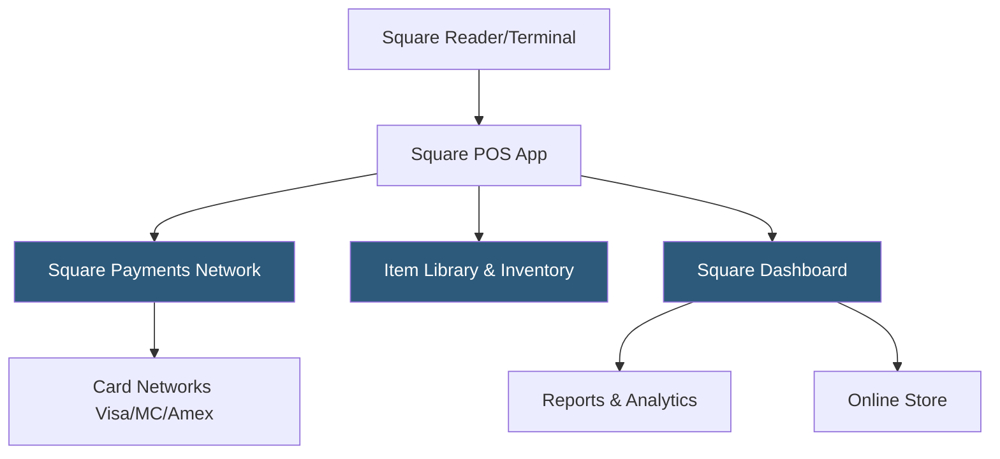

**Category:** Point of Sale (POS) Systems
**Difficulty:** Beginner
**Reading time:** 5 min read

---

Square POS is a cloud-based point of sale platform that democratized card acceptance for small businesses when it launched with its iconic magstripe card reader in 2009. Today it offers a comprehensive ecosystem spanning free POS software, proprietary hardware, online payments, payroll, and banking — all tightly integrated around a unified merchant dashboard. Square's free-tier POS software and pay-per-transaction pricing (no monthly fees at the base tier) makes it accessible for micro-businesses and side ventures.

- **Square Reader** — Square's line of card readers connecting via audio jack, Lightning, or Bluetooth; accepts magstripe, chip, and contactless payments
- **Square Terminal** — a standalone countertop payment device with a built-in screen and receipt printer; no separate tablet or hardware required
- **Square Register** — Square's dedicated dual-screen POS hardware with a merchant-facing display and customer-facing payment screen
- **Square Dashboard** — the web-based management console where merchants view sales reports, manage inventory, and configure their POS remotely
- **Square Reader SDK** — developer APIs allowing custom iOS/Android applications to accept in-person payments using Square's payment infrastructure
- **Offline Mode** — Square's ability to queue card transactions when internet connectivity is unavailable, processing them once connectivity is restored
- **Item Library** — a centralized product catalog shared across Square's in-person and online sales channels, maintaining consistent pricing and inventory
- **Square Shifts** — built-in employee scheduling and tip management integrated with payroll reporting

Square POS operates as a cloud-synced application on iPad, Android tablet, or Square's own hardware. Merchants build an item library in the Dashboard, which syncs across all devices and sales channels (in-person, Square Online Store, Square for Restaurants). When a customer makes a purchase, the cashier selects items from the catalog, and Square calculates totals including tax rates configured by jurisdiction.

Payment processing flows through Square's own payment processing network. Square is both the payment processor and the POS provider, eliminating a third-party processor relationship. Accepted payment methods include chip cards, magstripe, contactless (NFC including Apple Pay, Google Pay, and Samsung Pay), and manual card entry. Square's flat-rate pricing model charges 2.6% + $0.10 per in-person tap/chip transaction with no monthly fees on the free plan.

Funds from transactions are typically deposited into the merchant's linked bank account within 1–2 business days, or instantly for a 1.75% fee via Square's Instant Transfer feature. Merchants can also direct funds to a Square Checking account for immediate access.

Inventory tracking updates item quantities with each sale, supports low-stock alerts, and enables purchase order management. The Reports section in the Dashboard provides real-time and historical sales data by item, employee, time period, and location — with no additional analytics fees.

- Retail boutiques and pop-up shops needing no-contract card acceptance
- Food trucks and farmers market vendors using mobile card readers
- Full-service and quick-service restaurants using Square for Restaurants
- Service businesses (salons, fitness studios) combining bookings with payment
- Developers building custom checkout experiences via Square Reader SDK

| Advantage | Disadvantage |
|-----------|--------------|
| Free POS software eliminates recurring software costs | Per-transaction fees are higher than interchange-plus pricing for high-volume merchants |
| Flat-rate pricing is predictable and simple to understand | Account holds and fund reserves can disrupt cash flow for high-risk merchants |
| Rapid setup — accepting payments within minutes | Limited customization for complex enterprise retail requirements |
| Integrated ecosystem (payroll, banking, loans) reduces vendor count | Not ideal for businesses requiring complex tax configurations or multi-currency |

- [Shopify POS Integration](shopify-pos-integration.md)
- [Clover POS Platform](clover-pos-platform.md)
- [Cloud-Based POS Systems](cloud-based-pos-systems.md)

---
*Part of the [Point of Sale (POS) Systems](index.md) category · [Back to Master Index](../../index.md)*
