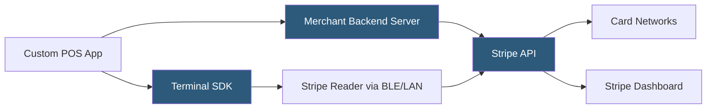

**Category:** Point of Sale (POS) Systems
**Difficulty:** Advanced
**Reading time:** 6 min read

---

Stripe Terminal is Stripe's developer-focused solution for in-person payment acceptance, providing SDKs for iOS, Android, JavaScript, and React Native that enable custom POS application builders to integrate Stripe's payment processing infrastructure into proprietary software. Unlike consumer POS platforms, Stripe Terminal targets software companies building their own POS products, ISVs (Independent Software Vendors) creating vertical market solutions, and enterprises needing tailored checkout experiences that existing POS platforms cannot provide.

- **Terminal SDK** — Stripe's client-side libraries that communicate with Stripe readers via Bluetooth Low Energy or USB/LAN, abstracting hardware protocol complexity from application code
- **Reader Object** — the SDK abstraction representing a physical Stripe card reader; the application discovers, connects to, and issues payment commands to Reader objects
- **PaymentIntent** — Stripe's server-side object representing a payment attempt; Terminal in-person payments use the same PaymentIntent API as online payments, enabling unified payment tracking
- **Collect Payment Method** — the SDK call that activates the card reader's card acceptance (prompts the customer to tap/insert/swipe); must complete before confirming payment
- **Simulated Reader** — a software-only test reader in the Terminal SDK that processes test payments without physical hardware, enabling development and CI/CD without card readers
- **Connection Token** — a short-lived server-generated token that authenticates the Terminal SDK instance to the Stripe API; must be fetched from the merchant's backend server, not the client
- **BBPOS WisePOS E** — Stripe's countertop smart reader running Android with a customer-facing display, EMV chip, NFC, and Wi-Fi connectivity
- **Handoff Mode** — a Terminal configuration for unattended or kiosk use where the reader operates without a connected POS application

Stripe Terminal follows a client-server architecture where sensitive operations are always server-side. The POS application frontend uses the Terminal SDK, but all API keys and payment confirmation logic must originate from a backend server the developer controls.

The integration flow begins with the backend generating a `ConnectionToken` by calling Stripe's API and passing it to the frontend SDK. The SDK uses this token to authenticate the SDK session without exposing secret API keys in client code. The POS app then calls `StripeTerminal.discoverReaders()` to find nearby readers via Bluetooth or network discovery and calls `connectReader()` to establish a connection.

When a customer is ready to pay, the backend creates a `PaymentIntent` via the Stripe API, specifying the amount and currency. The POS app retrieves the `client_secret` from the `PaymentIntent` and calls `collectPaymentMethod()` on the SDK, which activates the reader's card interface. The customer taps, inserts, or swipes their card, and the reader encrypts the card data on-device using end-to-end encryption before transmitting to Stripe's servers.

After `collectPaymentMethod()` completes, the app calls `processPayment()`, and Stripe handles the actual card network authorization. The result — approved or declined — returns to the SDK and should be written to the backend for order management.

Stripe Terminal supports several reader form factors: the BBPOS Chipper 2X BT (Bluetooth mobile reader), the BBPOS WisePad 3 (compact countertop), the BBPOS WisePOS E (smart countertop), and the Verifone P400 (customer-facing terminal). All support EMV chip, NFC contactless, and magstripe.

- ISVs building vertical POS solutions (spas, gyms, medical offices) needing embedded in-person payments
- Enterprise companies building custom retail kiosk or self-checkout experiences
- Multi-channel platforms wanting unified payment reporting across online and in-person transactions via one Stripe account
- Developers building restaurant or service industry applications where existing POS platforms are too rigid
- Companies using Stripe for online payments wanting to extend the same infrastructure in-store

| Advantage | Disadvantage |
|-----------|--------------|
| Unified online + in-person payment data in one Stripe Dashboard | Requires developer effort to build POS UI; not a ready-made product |
| Same PaymentIntent API for online and in-person simplifies reconciliation | Not cost-competitive with flat-rate POS platforms for low-volume merchants |
| Simulated reader enables hardware-free development and testing | Limited hardware form factors compared to traditional POS hardware ecosystems |
| Reader-to-cloud encryption handles PCI scope reduction automatically | Connection management complexity when multiple readers are deployed |

- [Cloud-Based POS Systems](cloud-based-pos-systems.md)
- [Square POS System](square-pos-system.md)
- [POS Payment Terminal Integration](pos-payment-terminal-integration.md)

---
*Part of the [Point of Sale (POS) Systems](index.md) category · [Back to Master Index](../../index.md)*
