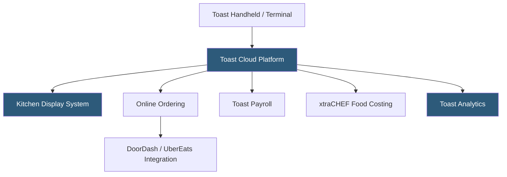

**Category:** Point of Sale (POS) Systems
**Difficulty:** Intermediate
**Reading time:** 6 min read

---

Toast POS is a restaurant-specific cloud-based point of sale platform built on Android hardware hardened for the demanding food service environment, offering an integrated suite covering front-of-house operations, kitchen display systems, online ordering, delivery management, payroll, and restaurant analytics. Unlike general-purpose POS systems adapted for restaurants, Toast was purpose-built for food service workflows including tableside ordering, menu modifiers, split checks, and course pacing, making it the leading restaurant POS platform by market share in the United States.

- **Kitchen Display System (KDS)** — a screen-based replacement for paper kitchen tickets showing orders in real time to kitchen staff with timing indicators and course pacing
- **Toast Go** — Toast's proprietary handheld Android device for tableside ordering and payment, eliminating multiple server trips per table
- **Menu Modifier Groups** — configurable add-on options attached to menu items (e.g., "add cheese +$1, substitute gluten-free bun +$2") that affect pricing and kitchen instructions
- **Course Pacing** — the ability to sequence dish preparation across courses (appetizers → entrees → desserts) so all dishes in a course fire to the kitchen simultaneously
- **Toast Online Ordering** — a commission-free direct online ordering channel embedded in the restaurant's website and app, integrated directly with the POS
- **Toast Payroll** — integrated restaurant-specific payroll with built-in tip pooling, tip credit calculations, and tip reporting for IRS Form 8027
- **Split Check** — the ability to divide a table's bill by seat, item, or custom amount, processed through the POS with individual payment methods
- **Open API** — Toast's REST API enabling integrations with reservation systems (OpenTable, Resy), accounting software, and delivery aggregators

Toast operates on a proprietary Android-based hardware ecosystem including countertop terminals, the Toast Flex (customer-facing order display), Toast Go handheld devices, and Kitchen Display Systems. Unlike iPad-based POS systems, Toast's hardware is built for grease, water, and temperature extremes common in kitchen environments.

The ordering workflow begins when a server selects a table or creates an order in the POS. Menu items are organized by category and modifier groups pre-configured in the Toast admin console. When a server adds an item with modifiers, Toast dynamically calculates the price adjustment and compiles the kitchen ticket with all preparation notes. Orders send to KDS stations in the kitchen, color-coded by elapsed time to help kitchen staff prioritize.

For table service, Toast supports complex multi-seat scenarios: individual seats can order separately, courses can fire at different times, and the bill can be split in multiple ways. The tip screen presented on the customer-facing display during payment is configurable, with suggested tip percentages set by management.

Toast's offline mode is hardware-based rather than internet-dependent: the POS hub (a local server appliance) maintains transaction processing capability during internet outages. This is critical for high-volume restaurants that cannot absorb internet downtime during peak service.

Toast's analytics platform tracks covers per server, average check size, menu item profitability, and labor cost percentages in real time. The xtraCHEF integration (a Toast acquisition) adds food cost management by connecting recipe ingredients to supplier invoicing.

- Full-service restaurants needing tableside ordering, course pacing, and check splitting
- Quick-service restaurants and fast-casual concepts needing drive-through integration
- Bar and nightclub operations requiring tab management and age verification workflows
- Multi-location restaurant groups wanting centralized menu management
- Ghost kitchens managing multiple virtual brands from a single kitchen operation

| Advantage | Disadvantage |
|-----------|--------------|
| Purpose-built for restaurants with features general POS systems lack | Hardware lock-in; must use Toast hardware, no bring-your-own-device option |
| Proprietary hardware designed for kitchen heat, grease, and drops | Higher total cost of ownership than iPad-based systems |
| Offline processing via local hub prevents downtime during internet outages | Multi-year contract requirements are common for hardware financing |
| Integrated online ordering eliminates third-party commission fees | Customer support quality varies; high-volume restaurants may experience response delays |

- [Cloud-Based POS Systems](cloud-based-pos-systems.md)
- [Square POS System](square-pos-system.md)
- [POS Kitchen Display Systems](pos-kitchen-display-systems.md)

---
*Part of the [Point of Sale (POS) Systems](index.md) category · [Back to Master Index](../../index.md)*
