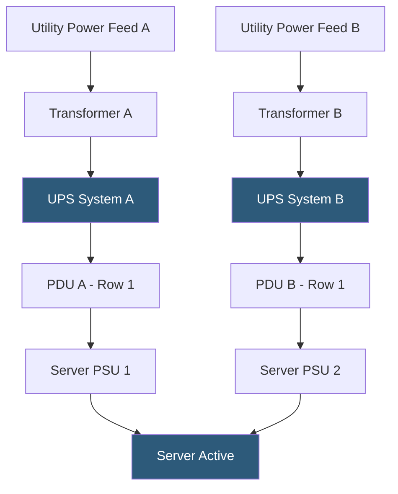

**Category:** Power Infrastructure
**Difficulty:** Advanced
**Reading time:** 7 min read

---

Datacenter power redundancy describes the architectural strategies used to ensure continuous power delivery to IT equipment even when individual power components fail. Redundancy is classified using an N-tier notation — N (no redundancy), N+1 (one extra unit), and 2N (fully duplicated systems) — with the level chosen based on the required uptime SLA and capital budget. A single power failure in a Tier 1 facility can take down an entire datacenter; a properly designed 2N system sustains full operations through any single-point failure including utility outages, PDU failures, and UPS failures.

- **N Redundancy** — exactly the minimum power components needed to run the load; any single failure causes downtime; appropriate only for dev/test environments
- **N+1 Redundancy** — one additional unit beyond minimum; if one fails, remaining units absorb the load without service interruption; common in Tier 3 datacenters
- **2N Redundancy** — fully duplicated power path from utility to server; each server has two power supplies fed by independent UPS and PDU chains; required for Tier 4 facilities
- **2N+1 Redundancy** — 2N with one additional spare unit; highest redundancy tier used in hyperscale and financial services environments
- **Uptime Institute Tiers** — the industry-standard datacenter classification system: Tier 1 (99.671% uptime) through Tier 4 (99.995% uptime), each with defined power redundancy requirements
- **Single Point of Failure (SPOF)** — any component whose failure would cause a complete loss of power to one or more servers; eliminating SPOFs is the goal of redundancy design
- **Dual-Corded Servers** — servers with two power supply units (PSUs) connected to independent power feeds, enabling a full power path to fail without server downtime
- **Critical Load** — the total power drawn by IT equipment (servers, networking, storage); used to size all redundant power components

Power enters a datacenter from the utility grid via high-voltage feeders (typically 15kV–115kV depending on facility size). The first redundancy decision is whether to take two independent utility feeds from different substations (true grid redundancy) or rely on a single feed with on-site generation as backup.

From the utility point of entry, power flows through distribution switchgear to Uninterruptible Power Supply (UPS) systems that provide battery backup and power conditioning. In an N+1 design, three UPS modules are deployed where two can carry the full load, so one can fail without dropping capacity below demand. In a 2N design, two completely independent UPS systems exist, each capable of carrying 100% of the critical load, with automatic static transfer switches (STS) that can switch between them in sub-millisecond time.

UPS output feeds Power Distribution Units (PDUs), which transform voltage for distribution through raised-floor or overhead cable trays to individual rack-mounted power strips. In 2N configurations, two separate PDUs feed each row of racks, and dual-corded servers connect one PSU to each PDU. This means the entire "A-side" power path (Utility Feed A → UPS A → PDU A) can fail completely without interrupting servers, as "B-side" carries the full load.

Generator backup systems (diesel, natural gas, or bi-fuel) provide long-duration backup when UPS batteries are depleted, typically after 10–30 minutes. Automatic Transfer Switches (ATS) detect utility outage and start generators, with transfer occurring within 10–15 seconds. N+1 or 2N generator configurations mirror the UPS redundancy level.

Maintaining redundancy requires rigorous change management: any maintenance activity on one power path must be performed with the full load running on the parallel path.

- Colocation providers designing facilities to meet Uptime Institute Tier 3 or 4 certification
- Enterprise datacenters requiring five-nines (99.999%) uptime for critical business systems
- Financial services firms where a power event causes regulatory and financial liability
- Cloud provider availability zone design requiring isolated failure domains
- Healthcare organizations where server downtime has patient safety implications

| Advantage | Disadvantage |
|-----------|--------------|
| 2N design eliminates all single points of failure in the power path | 2N systems cost 50–100% more than N+1 in capital expenditure |
| Dual-corded servers maintain uptime through any single PDU or UPS failure | 2N architecture requires servers with dual power supplies, adding hardware cost |
| Redundant utility feeds eliminate grid-based outage risk | Redundant utility feeds require negotiation with utility providers and easement rights |
| Modular UPS design allows maintenance without downtime | Increased component count increases maintenance complexity and cost |

- [UPS Types and Selection](uninterruptible-power-supply-ups-types.md)
- [Generator Backup Systems](generator-backup-systems.md)
- [Energy Efficiency Metrics PUE DCiE](energy-efficiency-metrics-pue-dcie.md)

---
*Part of the [Power Infrastructure](index.md) category · [Back to Master Index](../../index.md)*
