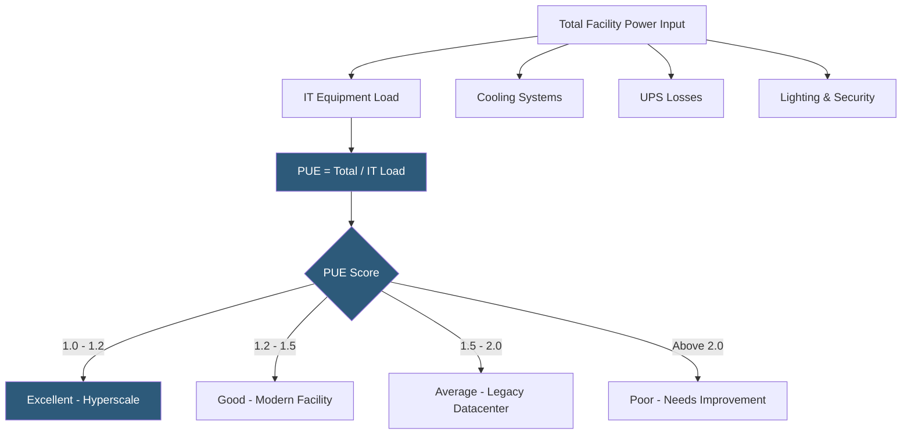

**Category:** Power Infrastructure
**Difficulty:** Intermediate
**Reading time:** 6 min read

---

Power Usage Effectiveness (PUE) and its inverse Data Center Infrastructure Efficiency (DCiE) are the primary metrics used to quantify how efficiently a datacenter uses its total power relative to the power consumed by IT equipment. A PUE of 1.0 is theoretically perfect — all power goes to IT equipment with none wasted on cooling, lighting, or power conditioning losses. Modern hyperscale datacenters achieve PUEs below 1.1 through advanced cooling designs, while the industry average remains around 1.55, indicating 55% of energy consumed provides no computational work.

- **PUE (Power Usage Effectiveness)** — total facility power divided by IT equipment power; always ≥1.0; lower is better
- **DCiE (Data Center Infrastructure Efficiency)** — the reciprocal of PUE (IT power / total power × 100%); expressed as a percentage; higher is better
- **IT Equipment Power** — the power consumed by servers, storage, and network equipment; measured at PDU outlets or with smart PDUs
- **Total Facility Power** — all power consumed by the facility including IT equipment, cooling systems, UPS losses, lighting, and security systems
- **Partial PUE** — a variant measuring only a portion of facility overhead (e.g., just cooling) to isolate specific efficiency improvements
- **WUE (Water Usage Effectiveness)** — liters of water consumed per kWh of IT equipment energy; important for water-cooled and evaporative cooling systems
- **CUE (Carbon Usage Effectiveness)** — CO2 equivalent emissions per kWh of IT energy; accounts for the carbon intensity of the local electricity grid
- **Annualized PUE** — PUE measured over a 12-month period to account for seasonal cooling variations rather than a single point-in-time measurement

PUE is calculated by measuring total power entering the datacenter at the utility meter and dividing by the power consumed only by IT equipment. For a datacenter drawing 10MW total with 6MW powering servers, storage, and networking, PUE = 10/6 = 1.67. The remaining 4MW is overhead — primarily cooling (typically 30–40% of total power), plus UPS conversion losses (3–7%), lighting, security systems, and building management systems.

Measurement methodology significantly affects reported PUE. The most accurate measurement takes power readings at the utility entrance for total facility power and at individual PDU branches for IT load. Less rigorous methods estimate one or both values, leading to comparability issues across facilities. The Green Grid (the industry consortium that created PUE) recommends specifying measurement boundaries and methods alongside any published PUE figures.

Cooling is the primary target for PUE improvement. Traditional computer room air conditioning (CRAC) units recirculate room air inefficiently. Modern approaches dramatically reduce cooling overhead:

- Hot/cold aisle containment increases cooling efficiency by 20–30% by preventing cool supply air from mixing with hot exhaust before reaching servers
- Economizer modes (free cooling) use outside air or cooling tower water to cool servers when ambient temperatures permit, eliminating mechanical chiller operation for much of the year
- Liquid cooling (direct liquid cooling, rear-door heat exchangers, or full immersion) removes heat at the source with 40–80% less energy than air cooling
- AI-driven cooling optimization (famously deployed by Google DeepMind in its datacenters) dynamically adjusts cooling setpoints to minimize energy use while maintaining safe temperatures

Google's hyperscale datacenters regularly achieve annualized PUEs of 1.10–1.12. Facebook (Meta) reports PUEs below 1.1 for its newer facilities. The colocation industry average hovers around 1.5–1.6, with legacy enterprise datacenters often exceeding 2.0.

- Colocation operators benchmarking efficiency against competitors for marketing differentiation
- Enterprise facilities managers identifying cooling inefficiencies for capital improvement projects
- Sustainability teams calculating datacenter carbon footprint for ESG reporting
- Data center designers selecting cooling technology to achieve target PUE thresholds
- Lease negotiations where tenants stipulate maximum PUE requirements as contract terms

| Advantage | Disadvantage |
|-----------|--------------|
| PUE provides a simple, comparable single metric for efficiency | PUE ignores IT equipment efficiency; a very efficient cooling system can't compensate for low server utilization |
| Improving PUE directly reduces operating costs for power and cooling | Very low PUE may require significant capital investment in cooling infrastructure |
| PUE improvements reduce carbon footprint without changing IT workloads | PUE varies with IT load; lightly loaded datacenters have worse PUE than fully utilized ones |
| Industry benchmarks enable peer comparison and goal-setting | PUE measurement inconsistency makes cross-facility comparisons unreliable without methodology disclosure |

- [Datacenter Power Redundancy](datacenter-power-redundancy.md)
- [Renewable Energy Integration](renewable-energy-integration.md)
- [Power Capacity Planning](power-capacity-planning.md)

---
*Part of the [Power Infrastructure](index.md) category · [Back to Master Index](../../index.md)*
