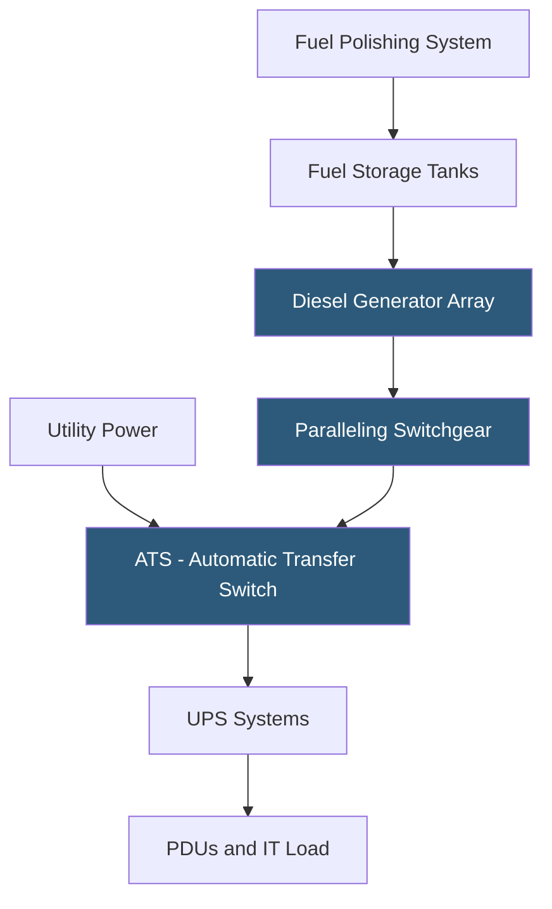

**Category:** Power Infrastructure
**Difficulty:** Advanced
**Reading time:** 7 min read

---

Generator backup systems provide long-duration power supply to datacenters when utility power is unavailable for extended periods beyond UPS battery runtime. Diesel generators remain the dominant technology due to their reliability, fast-start capability, and energy density, while natural gas, bi-fuel, and emerging hydrogen fuel cell systems offer cleaner alternatives. Generator sizing, transfer switch design, fuel storage capacity, and load testing protocols are critical engineering decisions that determine whether backup systems will perform when needed most.

- **Standby Generator** — a generator that starts automatically on utility failure; rated for intermittent use rather than continuous operation; common in most datacenters
- **Prime Power Generator** — a generator rated for continuous 24/7 operation; lower power rating than standby-rated equivalent; used for island-mode or off-grid datacenters
- **Automatic Transfer Switch (ATS)** — switchgear that detects utility outage, starts the generator, and automatically transfers load from utility to generator once stable voltage and frequency are established
- **Paralleling Switchgear** — equipment enabling multiple generators to run simultaneously sharing load; required for large datacenters where no single generator can power the full facility
- **Generator PLC (Programmable Logic Controller)** — the electronic controller managing generator start sequence, synchronization, load sharing, and protective shutdown triggers
- **Fuel Polishing** — a maintenance process that filters and cleans stored diesel fuel to prevent bacterial growth and particulate contamination that can cause generator failure
- **Load Bank Testing** — applying a resistive or reactive test load to a generator at full rated capacity to verify performance and identify issues before a real outage demands them
- **N+1 Generator Configuration** — deploying one more generator than the minimum needed to carry the full load, ensuring a single generator failure doesn't cause power loss

When utility power fails, the ATS detects the voltage dropout within cycles and sends a start signal to the generators. Diesel generators require 10–30 seconds to reach stable operating speed and voltage — the interval during which UPS batteries carry the critical load. Once generators reach stable output (typically 48–55Hz and within 5% of rated voltage), the ATS transfers the load from utility to generator. Modern static transfer switches can complete this transfer in under 100ms.

For large datacenters requiring multiple generators, paralleling switchgear synchronizes generator output before connecting units to the shared bus. Synchronization requires matching voltage, frequency, and phase angle across all generators within tight tolerances before closing the parallel breaker. Generators that are out of phase when paralleled can cause destructive current surges.

Fuel systems are often the weakest point in backup power design. Diesel degrades within 6–12 months without treatment, and stored fuel is susceptible to bacterial contamination that clogs injectors. Day tanks (small fuel reservoirs adjacent to each generator) hold 8–24 hours of fuel at full load, fed from larger base tanks with days to weeks of fuel capacity. Fuel polishing systems continuously filter and circulate stored fuel to maintain quality.

Generator sizing accounts for the total critical load plus motor start surge currents. Large UPS systems, computer room air handlers, and chiller pumps all have significant inrush currents when starting, potentially 3–6x their running current. Generators must be sized to handle these transients without the voltage dropping below UPS tolerances.

Load bank testing at full rated capacity should occur quarterly for critical facilities and annually at minimum. Testing validates that generators start reliably under load, reach temperature equilibrium, and maintain stable output throughout the test period.

- Datacenters requiring backup power beyond the 10–30 minute UPS battery window
- Facilities in regions with unreliable grid power requiring extended island-mode operation
- Critical infrastructure sites (hospitals, financial exchanges) where outage has immediate life-safety or financial consequences
- Edge datacenters in remote locations with no redundant utility grid connections
- Colocation providers marketing generator runtime (typically 48–72 hours of fuel storage) as a differentiator

| Advantage | Disadvantage |
|-----------|--------------|
| Diesel generators are highly reliable with proven start-up performance | Diesel fuel storage creates fire risk and requires regulatory permitting |
| On-site fuel supply provides independence from external infrastructure | Generator testing creates noise and emissions; may face local ordinance restrictions |
| Paralleling allows modular expansion matching load growth | Fuel degradation requires ongoing maintenance and polishing programs |
| Natural gas generators eliminate fuel storage but depend on gas utility | Natural gas generators may face supply disruption in the same event causing utility outage |

- [Datacenter Power Redundancy](datacenter-power-redundancy.md)
- [Uninterruptible Power Supply UPS Types](uninterruptible-power-supply-ups-types.md)
- [Power Monitoring and Metering](power-monitoring-and-metering.md)

---
*Part of the [Power Infrastructure](index.md) category · [Back to Master Index](../../index.md)*
