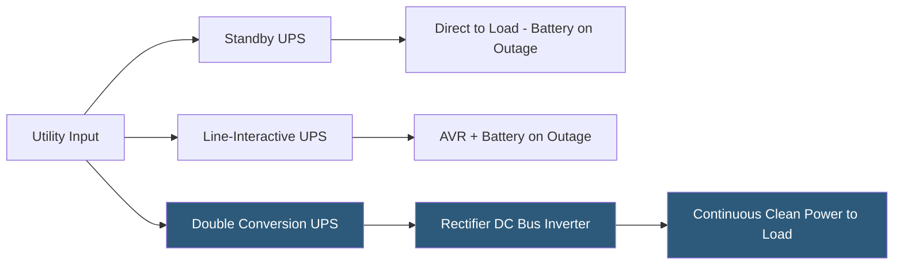

**Category:** Power Infrastructure
**Difficulty:** Intermediate
**Reading time:** 6 min read

---

Uninterruptible Power Supply (UPS) systems provide battery-backed power conditioning between the utility grid and critical IT equipment, protecting against power outages, voltage sags, surges, and harmonic distortion. The three primary UPS topologies — standby, line-interactive, and double conversion (online) — differ fundamentally in how they handle power in normal operation, determining their protective capabilities and efficiency profiles. Datacenters require double-conversion UPS systems for continuous isolation from power quality issues; line-interactive units are suitable for edge and branch office deployments.

- **Standby UPS** — the simplest topology; AC power passes through directly to the load with the battery only engaging on outage; minimal protection against power quality issues; suitable for workstations
- **Line-Interactive UPS** — adds an automatic voltage regulator (AVR) that corrects voltage fluctuations without switching to battery; common in SMB server rooms
- **Double Conversion (Online) UPS** — converts AC to DC then back to AC continuously; the load always runs on clean inverter-generated power; provides the highest power quality isolation; standard for datacenter deployments
- **VRLA Battery (Valve-Regulated Lead-Acid)** — the traditional UPS battery chemistry; sealed, maintenance-free, 3–5 year lifespan; heavy and sensitive to high temperatures
- **Lithium-Ion UPS Battery** — modern alternative to VRLA; 2–3x longer lifespan (10 years), 60–70% lighter weight, faster recharge, better high-temperature performance; higher initial cost
- **Transfer Time** — the time between utility failure and the UPS switching to battery; standby UPS: 20–25ms; online UPS: 0ms (already on inverter)
- **Runtime** — the duration the UPS can power the load from batteries; determined by battery capacity (kWh) divided by load power (kW)
- **Modular UPS** — a UPS architecture using hot-swappable power modules within a frame, enabling capacity scaling and maintenance without shutdown

In a standby UPS, utility AC power flows directly to the connected equipment through a transfer switch, bypassing the battery and inverter. The battery charger keeps batteries at full charge. When utility power fails or falls outside acceptable voltage/frequency ranges, the transfer switch engages the inverter, which converts stored DC battery power to AC. The 20–25ms transfer time is acceptable for most IT equipment because power supplies have sufficient capacitance to ride through the switch.

Line-interactive UPS adds a multi-tap transformer (autotransformer) in series with the power path that automatically adjusts output voltage when input voltage sags or swells. This handles the most common power disturbances (brownouts, voltage surges) without engaging the battery, significantly extending battery life. Transfer to battery only occurs for complete outages.

Double-conversion (online) UPS permanently isolates the load from the utility. Incoming AC is rectified to DC, which simultaneously charges batteries and powers an inverter that continuously generates fresh AC output at the correct voltage and frequency. Since the load always runs from the inverter, there is no transfer time — no switching occurs on utility failure because the inverter was already powering the load. This complete electrical isolation eliminates the impact of all power quality issues including frequency variations, voltage disturbances, and high-frequency noise.

Modular UPS systems have become the standard in modern datacenters. Rather than a single monolithic unit, multiple hot-swappable modules (typically 25–50kW each) populate a chassis frame. If a module fails, technicians replace it without scheduling a maintenance window because redundant modules carry the load.

Lithium-ion batteries are increasingly replacing VRLA in new UPS installations due to their 10-year lifespan (versus 3–5 years for VRLA), significantly reducing replacement labor costs over the datacenter's operational life.

- Double-conversion UPS for datacenter server rows requiring zero-transfer-time power protection
- Line-interactive UPS for branch office server closets with limited budget for power conditioning
- Modular UPS deployments in hyperscale datacenters enabling incremental capacity expansion
- Lithium-ion UPS retrofits in high-temperature datacenters where VRLA lifespan is shortened
- Runtime calculation planning for facilities sizing battery strings for 10–30 minute generator start windows

| Advantage | Disadvantage |
|-----------|--------------|
| Double-conversion eliminates all power quality issues reaching IT equipment | Double-conversion efficiency is 93–97% vs 99% for line-interactive; heat generation increases |
| Modular UPS enables maintenance without planned downtime | Modular UPS chassis costs more per kW than equivalent monolithic systems |
| Lithium-ion batteries have 2–3x VRLA lifespan, reducing replacement cycles | Lithium-ion UPS has 30–40% higher upfront cost vs VRLA equivalent |
| Online UPS provides zero transfer time on utility failure | Double-conversion UPS generates more heat requiring additional cooling capacity |

- [Datacenter Power Redundancy](datacenter-power-redundancy.md)
- [Generator Backup Systems](generator-backup-systems.md)
- [Power Monitoring and Metering](power-monitoring-and-metering.md)

---
*Part of the [Power Infrastructure](index.md) category · [Back to Master Index](../../index.md)*
