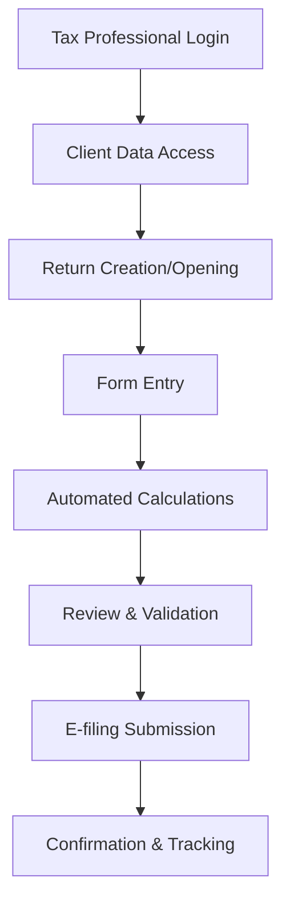

**Category:** Professional Tax Software
**Difficulty:** Intermediate
**Reading time:** 6 min read

---

Intuit ProConnect Tax Online is a cloud-based tax preparation platform for tax professionals, providing online access to tax return preparation, e-filing, and client management. It enables remote work, collaboration, and seamless integration with Intuit's professional ecosystem.

- **Cloud Delivery** — No local installation, access from any device
- **Multi-User Collaboration** — Multiple preparers working on same return
- **E-filing Integration** — Direct IRS and state filing capabilities
- **Client Data Security** — Encrypted storage and audit trails
- **Workflow Automation** — Automated calculations, validations, and scheduling

Professionals log into the cloud platform via secure authentication. Client data is retrieved from the system or imported from prior returns. The interface presents tax forms (1040, 1120, 1065, etc.) with guided entry fields. Automated calculations apply tax rules and generate supporting schedules. Validation rules flag errors and omissions in real-time. Multi-user workflows allow preparers and managers to review different sections. The system maintains version history and audit trails for compliance. E-filing integration submits returns directly to IRS and state agencies, providing acceptance confirmation and tracking.

- Remote tax preparation by distributed teams
- Multi-state tax preparation and filing
- Client-facing secure portal for document sharing
- Enterprise tax departments managing large return volumes
- Collaboration between preparers and reviewers
- Continuous engagement throughout tax season

| Advantage | Disadvantage |
|-----------|--------------|
| Cloud-based, no infrastructure requirements | Internet dependency for all operations |
| Secure, encrypted data storage | Subscription-based pricing model |
| Built-in e-filing and tax updates | Limited custom form support |
| Multi-user collaboration features | Steeper learning curve for new users |
| Real-time calculations and validations | Data migration from prior platforms |

- [Intuit ProConnect Tax Desktop](intuit-proconnect-tax-desktop.md)
- [Tax Return E-filing Systems](tax-return-e-filing-systems.md)
- [IRS E-file Integration](irs-e-file-integration.md)

---
*Part of the [Professional Tax Software](index.md) category · [Back to Master Index](../../index.md)*
