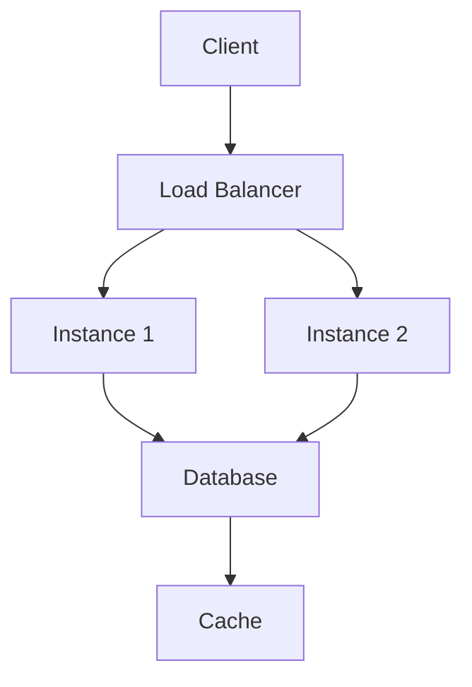

**Category:** Prototyping & User Testing
**Difficulty:** Intermediate
**Reading time:** 6 min read

---

Lucky Orange conversion analytics is a fundamental concept within Prototyping & User Testing that enables teams to build scalable, reliable systems. Mastering it allows engineers to make informed architectural decisions and operate infrastructure more effectively.

- **Core abstraction** — the primary interface that lucky orange conversion analytics exposes to consumers and operators
- **Configuration layer** — settings and parameters that control lucky orange conversion analytics runtime behavior
- **Scalability model** — how lucky orange conversion analytics grows to meet increasing demand without redesign
- **Reliability mechanisms** — the built-in fault-tolerance and recovery capabilities
- **Observability surface** — metrics, logs, and traces emitted for operational visibility

Lucky Orange conversion analytics functions as part of the Prototyping & User Testing stack by abstracting lower-level complexity behind a defined interface. Incoming requests or workloads are received by an ingestion layer that handles authentication, validation, and routing before passing control to the core processing engine.

The engine applies the primary logic — whether computation, data transformation, coordination, or storage — and produces a result. State is maintained using a combination of ephemeral in-memory caches for fast reads and durable backing stores for persistence. Configuration is externalized to allow behavior changes without redeployment.

Health signals are continuously emitted to monitoring systems, enabling automated alerts when thresholds are exceeded. Integration with adjacent services occurs through versioned APIs or message queues, maintaining loose coupling. Infrastructure is provisioned via declarative tooling to ensure reproducibility across environments. Autoscaling policies adjust capacity in response to real-time load metrics, minimizing both over-provisioning costs and under-provisioning latency spikes.

- Running lucky orange conversion analytics in production environments that require high availability and fault tolerance
- Integrating lucky orange conversion analytics with CI/CD pipelines for automated deployment and rollback
- Scaling lucky orange conversion analytics horizontally to handle traffic spikes and bursty workloads
- Securing lucky orange conversion analytics with authentication, encryption, and access control policies
- Monitoring lucky orange conversion analytics with metrics dashboards and automated alerting

| Advantage | Disadvantage |
|-----------|--------------|
| Reduces manual operations through automation and abstraction | Abstraction can hide low-level failure modes from operators |
| Enables consistent deployments across development and production | Initial configuration and integration requires upfront effort |
| Scales horizontally to meet growing demand | Distributed deployment introduces consistency and latency trade-offs |
| Integrates with standard ecosystem tooling | May introduce vendor or platform dependency over time |

- [Back to Prototyping & User Testing Index](index.md)
- [Master Index](../../index.md)

---
*Part of the [Prototyping & User Testing](index.md) category · [Back to Master Index](../../index.md)*
