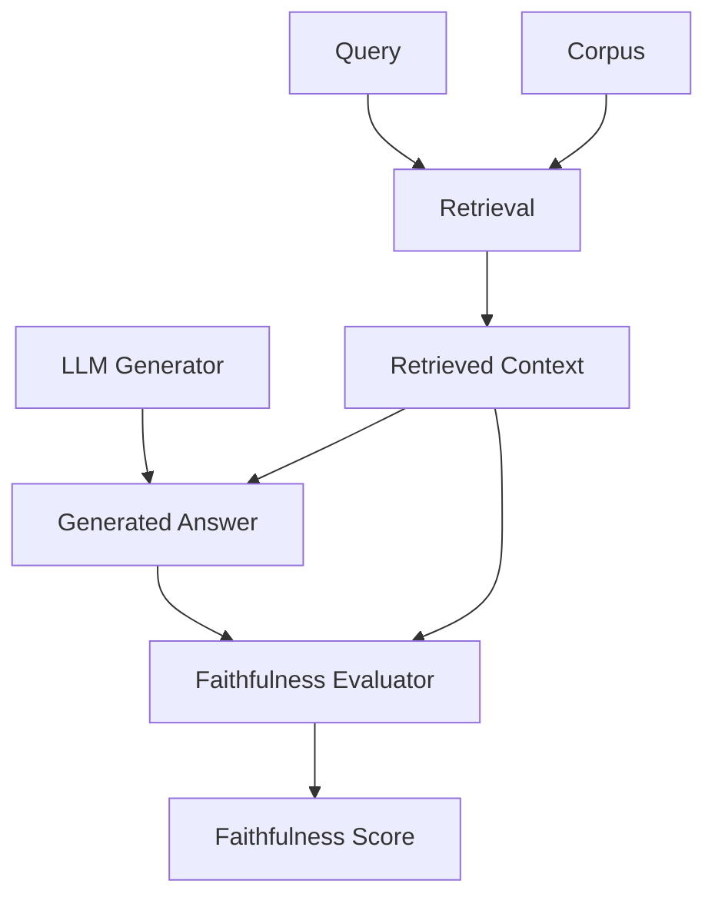

**Category:** RAG (Retrieval Augmented Generation)
**Difficulty:** Intermediate
**Reading time:** 6 min read

---

Answer faithfulness measures how accurately generated responses reflect the information in retrieved documents, preventing hallucinations and ensuring outputs are grounded in source material. This metric is critical for trustworthy RAG systems.

- **Hallucination detection** — identifying claims not supported by context
- **Faithfulness score** — quantifying alignment between answer and sources
- **Ground truth evaluation** — comparing answers against reference materials
- **Entailment checking** — verifying answer statements follow from retrieved content
- **Factuality verification** — validating claim accuracy

Answer faithfulness evaluation assesses whether generated responses contain only information supported by the retrieved documents or other grounded sources. Methods include human evaluation (annotators judge whether statements are supported), automatic evaluation using entailment models (checking if answer text is logically entailed by context), and LLM-based assessment (prompting models to identify unsupported claims). Faithfulness is distinct from factuality (whether claims are factually true in the world)—an unfaithful but true answer disagrees with sources while a faithful answer accurately reflects provided materials. Fine-grained evaluation identifies specific hallucinations: sentences or claims contradicting sources. Faithfulness metrics can be strict (any unsupported detail reduces score) or lenient (only major hallucinations count). Advanced systems combine factuality and faithfulness scoring: faithful but false answers indicate source document problems while unfaithful answers indicate generator failure. Evaluation challenges include defining "support"—paraphrases and inferences about sources complicate judgments.

- Detecting and preventing hallucinations
- Evaluating LLM generation quality
- Assessing knowledge base document quality
- Trustworthiness verification for critical applications
- Quality control in production RAG systems

| Advantage | Disadvantage |
|-----------|--------------|
| Directly measures hallucination risk | Distinguishing faithfulness from factuality is complex |
| Multiple evaluation approaches available | Automatic scoring has limited accuracy |
| Critical for high-stakes applications | Expensive to annotate at scale |
| Identifies specific generation failures | Hard to define "supported by" precisely |
| Enables trust assessment | Inference and paraphrase handling is challenging |

- [Source attribution](source-attribution.md)
- [RAG evaluation metrics](rag-evaluation-metrics.md)
- [LLM-as-judge for RAG evaluation](llm-as-judge-for-rag-evaluation.md)

---
*Part of the [RAG (Retrieval Augmented Generation)](index.md) category · [Back to Master Index](../../index.md)*
