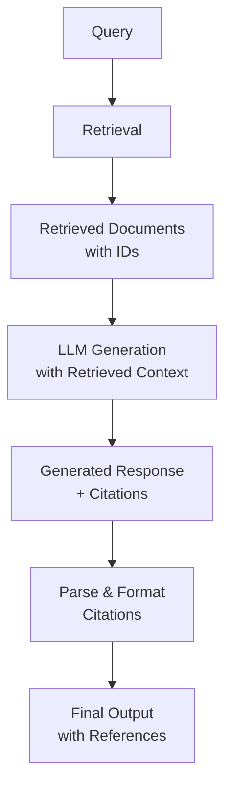

**Category:** RAG (Retrieval Augmented Generation)
**Difficulty:** Intermediate
**Reading time:** 6 min read

---

Citation generation in RAG systems automatically creates references to source documents that supported generated responses. This capability is essential for transparency, verifiability, and building user trust in AI-generated content.

- **Citation tracking** — maintaining links between generated text and source documents
- **Span attribution** — assigning specific generated spans to source passages
- **In-context learning** — using examples to guide citation patterns
- **Retrieval-augmented citation** — leveraging retrieved documents for source verification
- **Citation formatting** — standardizing reference presentation

Citation generation involves tracking which source documents the LLM accessed during response generation and attributing specific claims to those sources. Methods vary in sophistication: simple approaches track all retrieved documents as potential sources; intermediate approaches mark which documents the LLM referenced in its reasoning; advanced approaches perform fine-grained attribution matching generated spans to specific source passages. During generation, the LLM can be prompted to include explicit citations like [Doc1, Sec3] which are later resolved to proper references. Some systems use retrieval-augmented generation with explicit source tracking, passing document IDs and metadata so the LLM can reference them directly. Post-hoc attribution matches generated text against source documents to verify claims and create citations. The challenge is balancing accuracy (citing only truly relevant sources) with completeness (identifying all supporting sources). Advanced systems use specialized models trained on citation tasks to improve attribution accuracy.

- Question-answering systems requiring verifiable answers
- Legal and compliance document processing
- Academic and research paper analysis
- Medical and healthcare information systems
- Regulatory compliance where source traceability is required

| Advantage | Disadvantage |
|-----------|--------------|
| Improves transparency and user trust | Adds complexity to generation pipeline |
| Enables verification of claims | May reduce generation fluency |
| Supports regulatory compliance | Citation accuracy depends on implementation |
| Builds accountability for statements | Overhead in tracking and attribution |
| Essential for high-stakes applications | Requires careful prompt engineering |

- [Source attribution](source-attribution.md)
- [Confidence scoring for retrieved docs](confidence-scoring-for-retrieved-docs.md)
- [RAG evaluation metrics](rag-evaluation-metrics.md)

---
*Part of the [RAG (Retrieval Augmented Generation)](index.md) category · [Back to Master Index](../../index.md)*
