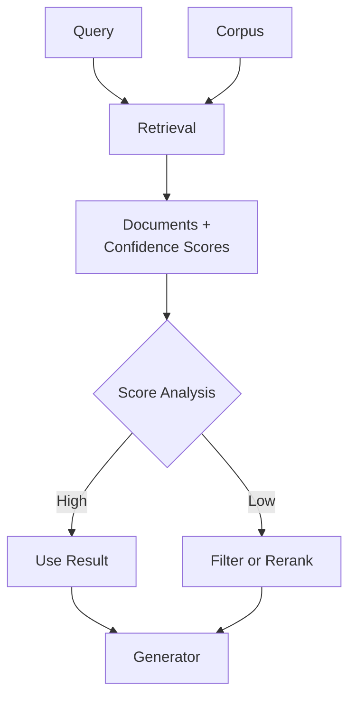

**Category:** RAG (Retrieval Augmented Generation)
**Difficulty:** Intermediate
**Reading time:** 6 min read

---

Confidence scoring quantifies how relevant retrieved documents are to a query, enabling systems to make informed decisions about result quality and reliability. High confidence scores indicate strong relevance, while low scores signal uncertainty about document utility.

- **Relevance scoring** — quantifying document match to query
- **Confidence metrics** — probabilistic measures of relevance certainty
- **Score calibration** — ensuring scores reflect true relevance probabilities
- **Threshold filtering** — removing low-confidence results
- **Uncertainty quantification** — measuring confidence in predictions

Confidence scoring methods produce numerical values (typically 0-1) indicating retrieval result quality. Dense retrieval models can output cosine similarity scores as base confidence, though these often require calibration to represent true probabilities. Cross-encoder reranking models naturally produce probabilistic scores. Ensemble methods combine scores from multiple retrievers to increase confidence in agreement or detect disagreement. Calibration techniques adjust raw model outputs to better represent true relevance probabilities, essential because model confidence often differs from actual accuracy. Confidence scores enable threshold-based filtering—discarding results below a confidence threshold—or triggering alternative retrieval strategies when confidence is low. Dynamic thresholding adjusts requirements based on query difficulty. Advanced approaches estimate confidence through ensemble disagreement, query-document similarity distributions, or Bayesian uncertainty quantification. These scores are particularly valuable in low-data domains where retrieval quality is uncertain, and in production systems where result quality directly affects user experience.

- Filtering unreliable results before passing to LLM
- Confidence-aware result ranking and curation
- Triggering alternative retrieval strategies on low confidence
- Quality control and result validation
- User-facing systems where confidence is displayed

| Advantage | Disadvantage |
|-----------|--------------|
| Enables quality-aware result filtering | Scores often poorly calibrated |
| Improves system reliability | Adds computational overhead |
| Supports adaptive retrieval strategies | Calibration requires labeled data |
| Quantifies result uncertainty | Hard to interpret cross-domain |
| Useful for result aggregation | Quality depends on scoring model |

- [RAG evaluation metrics](rag-evaluation-metrics.md)
- [Cross-encoder reranking](cross-encoder-reranking.md)
- [Source attribution](source-attribution.md)

---
*Part of the [RAG (Retrieval Augmented Generation)](index.md) category · [Back to Master Index](../../index.md)*
