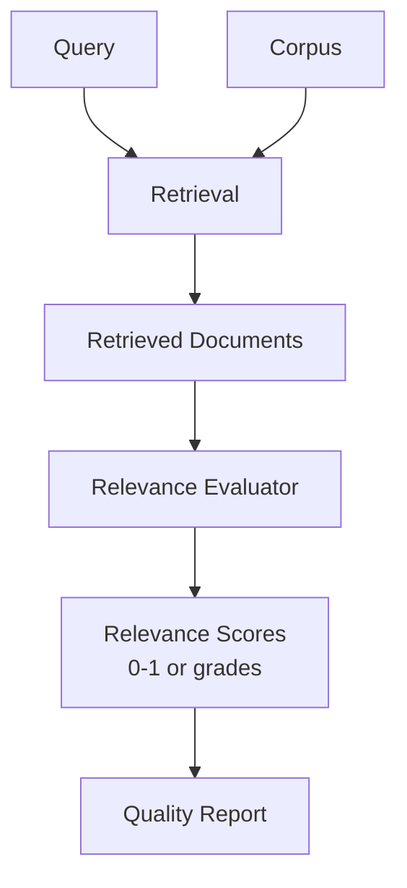

**Category:** RAG (Retrieval Augmented Generation)
**Difficulty:** Intermediate
**Reading time:** 6 min read

---

Context relevance scoring measures how relevant retrieved documents are to answering a query. This metric directly evaluates retrieval quality, ensuring documents in the RAG context actually address the user's information need.

- **Relevance judgment** — assessing document-query match
- **Semantic relevance** — meaningful relationship beyond keyword overlap
- **Grading scales** — categorical (relevant/irrelevant) or continuous scores
- **Annotator agreement** — consistency in relevance judgments
- **Automatic scoring** — LLM-based relevance assessment

Context relevance scoring assesses whether retrieved documents contain information needed to answer a query. Human evaluation uses trained annotators who judge each document on a relevance scale (binary, ternary, or continuous). Inter-annotator agreement is measured using kappa statistics to ensure consistency. Automatic relevance scoring uses LLM-based approaches where a model is prompted to assess document relevance to a query, often more cost-effective and scalable than human annotation. Evaluation frameworks like TREC and BEIR provide benchmark datasets with relevance judgments. Relevance metrics aggregate individual document judgments into system-level scores: recall (proportion of relevant documents retrieved), precision (proportion of retrieved documents that are relevant), and MRR (rank of first relevant document). Evaluation considers different relevance levels—some documents are marginally relevant while others directly answer the query. Challenge lies in defining relevance criteria that align with downstream task success, particularly determining whether marginal relevance counts.

- Retrieval system benchmarking and comparison
- Identifying degradation in production systems
- Parameter tuning for retrieval components
- Research evaluation and publication
- Quality assurance in knowledge bases

| Advantage | Disadvantage |
|-----------|--------------|
| Directly measures retrieval quality | Human evaluation is costly and slow |
| Multiple evaluation methods available | Automatic scoring quality varies |
| Clear metrics for system comparison | Context-dependent relevance is hard to define |
| Identifies specific retrieval failures | Benchmark datasets may not match production |
| Standard benchmarks enable reproducibility | Metric correlation with end-user satisfaction |

- [RAG evaluation metrics](rag-evaluation-metrics.md)
- [Answer faithfulness](answer-faithfulness.md)
- [LLM-as-judge for RAG evaluation](llm-as-judge-for-rag-evaluation.md)

---
*Part of the [RAG (Retrieval Augmented Generation)](index.md) category · [Back to Master Index](../../index.md)*
