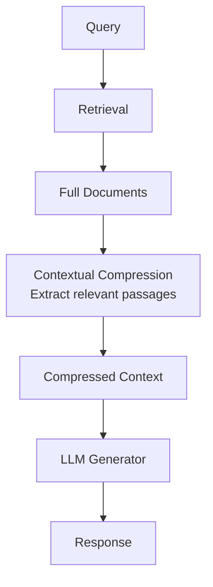

**Category:** RAG (Retrieval Augmented Generation)
**Difficulty:** Intermediate
**Reading time:** 6 min read

---

Contextual compression extracts only the relevant portions of retrieved documents, reducing noise and token usage. Rather than passing entire documents to the LLM, this technique identifies and isolates the sentences or passages most relevant to the query.

- **Passage extraction** — identifying relevant text segments within documents
- **Relevance filtering** — removing irrelevant portions before LLM processing
- **Query-focused summarization** — creating document summaries targeted to specific queries
- **Token optimization** — reducing context window usage and inference cost
- **Context preservation** — maintaining coherence while removing non-essential text

After initial document retrieval, contextual compression applies a second stage that analyzes which parts of the retrieved documents are most relevant to the query. Methods include LLM-based selection (using a model to identify pertinent passages), embedding-based filtering (selecting passages most similar to the query), or rule-based extraction (identifying sentences containing query terms). The compressed context—typically just the most relevant passages—is then passed to the generation LLM instead of complete documents. This approach provides two benefits: reduced token consumption leading to faster inference and lower costs, and improved generation quality by removing distracting information. Some implementations use extractive methods (choosing existing sentences) while others employ abstractive compression (generating summaries). Iterative approaches allow progressive refinement, where initial compression is re-evaluated and further refined. The compression stage sits between retrieval and generation, making it compatible with most RAG architectures.

- Reducing LLM input length and inference costs
- Processing long documents with minimal relevant information
- Improving response quality by focusing on relevant content
- Token-constrained environments with limited context windows
- Multi-document scenarios where aggregation would be verbose

| Advantage | Disadvantage |
|-----------|--------------|
| Reduces token usage and inference cost | May miss relevant context if compression too aggressive |
| Improves response focus and clarity | Additional compression step adds latency |
| Works with existing retrieval systems | Quality depends on compression algorithm |
| Significant cost savings on long documents | Risk of removing nuanced but important information |
| Allows larger document sets within context limits | Requires tuning compression parameters |

- [Retrieval strategies](retrieval-strategies.md)
- [Reranking models (Cohere, Jina)](reranking-models-cohere-jina.md)
- [Self-querying retrievers](self-querying-retrievers.md)

---
*Part of the [RAG (Retrieval Augmented Generation)](index.md) category · [Back to Master Index](../../index.md)*
