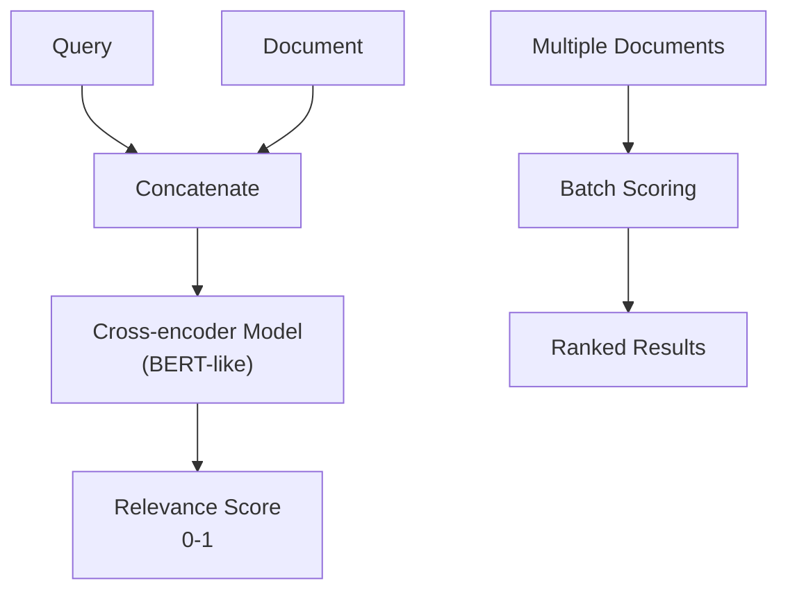

**Category:** RAG (Retrieval Augmented Generation)
**Difficulty:** Intermediate
**Reading time:** 6 min read

---

Cross-encoder models jointly encode query-document pairs to produce relevance scores, providing superior ranking accuracy compared to bi-encoder methods. These models excel at fine-grained relevance assessment, making them ideal for reranking pipelines where ranking precision is critical.

- **Joint encoding** — processing query and document together as a single input
- **Relevance scoring** — predicting likelihood of relevance on a continuous scale
- **Bi-encoder vs cross-encoder** — trade-offs between efficiency and accuracy
- **Pointwise ranking** — scoring individual query-document pairs
- **Model architecture** — transformer-based models with classification heads

Cross-encoder models use transformer architectures (like BERT) that take a concatenated query-document pair as input and output a relevance score. Unlike bi-encoders that independently encode queries and documents, cross-encoders can model interactions between query terms and document content, capturing subtle relevance signals. During inference, each candidate document is scored individually, so scoring k documents requires k forward passes. This computational overhead makes cross-encoders impractical for initial retrieval over large corpora, but ideal for reranking where k is small. The models are typically trained on datasets of human relevance judgments, learning to predict whether a document is relevant to a query. Popular cross-encoder models include mBERT variants trained on multilingual data and domain-specific models fine-tuned for particular industries. The output scores can be calibrated to represent true relevance probabilities, allowing threshold-based filtering. Advanced implementations batch-process documents to parallelize scoring.

- Reranking top-k candidates from initial retrieval
- High-precision ranking where accuracy matters more than speed
- Specialized domains with available training data
- Learning-to-rank pipelines
- Quality-critical search applications

| Advantage | Disadvantage |
|-----------|--------------|
| Superior ranking quality vs bi-encoders | Computationally expensive for large sets |
| Captures query-document interactions well | Requires k forward passes for k documents |
| Strong performance on diverse domains | Slower inference than bi-encoder methods |
| Well-understood and widely used approach | Limited to reranking, not initial retrieval |
| Interpretable relevance scores | Needs labeled training data for fine-tuning |

- [Reranking models (Cohere, Jina)](reranking-models-cohere-jina.md)
- [Dense retrieval](dense-retrieval.md)
- [MMR (Maximal Marginal Relevance)](mmr-maximal-marginal-relevance.md)

---
*Part of the [RAG (Retrieval Augmented Generation)](index.md) category · [Back to Master Index](../../index.md)*
