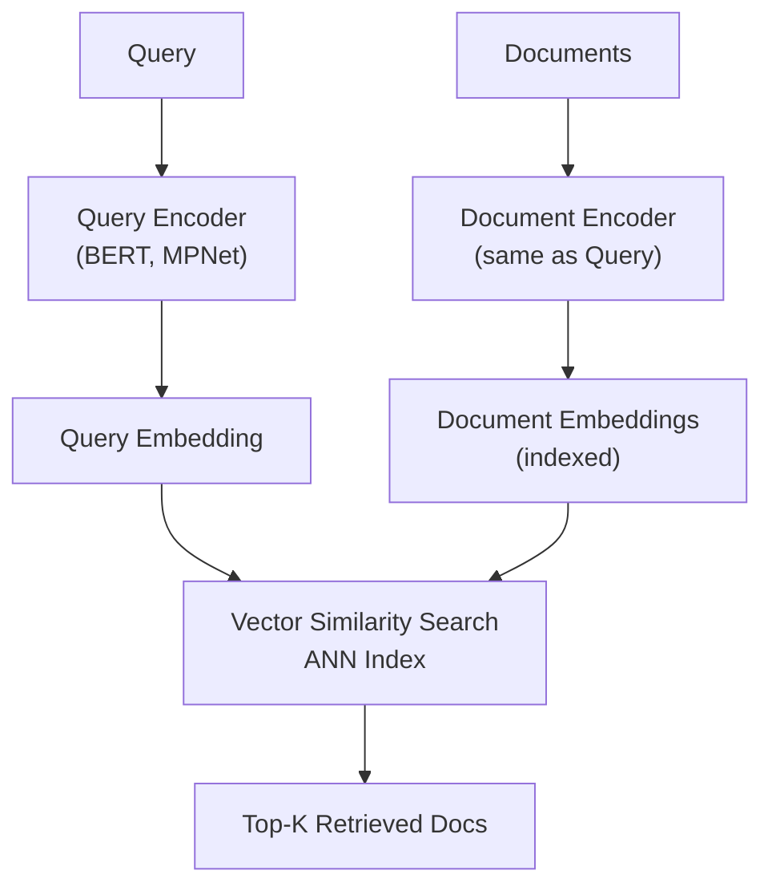

**Category:** RAG (Retrieval Augmented Generation)
**Difficulty:** Intermediate
**Reading time:** 6 min read

---

Dense retrieval uses neural embeddings to represent documents and queries in a continuous vector space, enabling semantic similarity-based retrieval. Unlike sparse keyword matching, dense methods capture meaning, synonymy, and contextual relationships, making them effective for open-domain question answering and semantic search.

- **Embedding models** — neural networks that convert text to fixed-dimensional vectors
- **Semantic similarity** — measuring relevance based on meaning rather than keywords
- **Bi-encoder architecture** — separate encoders for queries and documents for efficient search
- **Cross-encoder architecture** — jointly encoding query-document pairs for high-accuracy scoring
- **Vector indexing** — data structures like FAISS for fast approximate nearest neighbor search

Dense retrieval systems train neural encoders on supervised or unsupervised data to produce embeddings where semantically similar texts cluster together. During indexing, all documents are encoded once and stored in an approximate nearest neighbor (ANN) index like FAISS or Annoy for rapid retrieval. At query time, the same encoder converts the user query into an embedding, then the ANN index finds the k nearest document embeddings in vector space. Bi-encoder models are computationally efficient—the query encoder runs only at retrieval time, while document embeddings are pre-computed. The quality of dense retrieval depends on the encoder's training data; models trained on question-answer pairs or related retrieval tasks outperform general-purpose language models. Cross-encoder models offer higher accuracy by jointly scoring query-document pairs but require more computation, making them suitable for reranking stages rather than initial retrieval.

- Open-domain question answering systems
- Semantic search applications
- Recommendation systems based on content similarity
- Multi-lingual retrieval with shared embedding space
- Documents with varied vocabulary and phrasing

| Advantage | Disadvantage |
|-----------|--------------|
| Captures semantic meaning and synonymy | Requires model training or pre-trained weights |
| Handles vocabulary gaps effectively | Slower than sparse retrieval at scale |
| Single unified search across modalities | Performance depends heavily on encoder quality |
| Sub-linear search time with ANN indices | Difficulty incorporating exact keyword constraints |
| Works well for narrative and long documents | Embedding updates require full re-indexing |

- [Sparse retrieval (BM25, TF-IDF)](sparse-retrieval-bm25-tf-idf.md)
- [Hybrid retrieval systems](hybrid-retrieval-systems.md)
- [Cross-encoder reranking](cross-encoder-reranking.md)

---
*Part of the [RAG (Retrieval Augmented Generation)](index.md) category · [Back to Master Index](../../index.md)*
