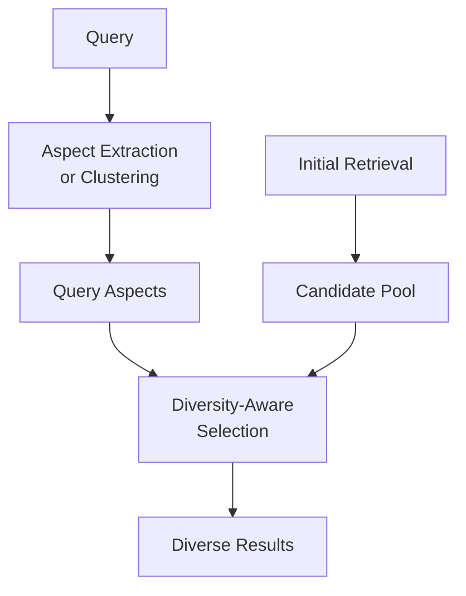

**Category:** RAG (Retrieval Augmented Generation)
**Difficulty:** Intermediate
**Reading time:** 6 min read

---

Diversity in retrieval ensures result sets cover multiple aspects of a topic rather than clustering around a single interpretation. Diversity-aware retrieval improves user satisfaction by preventing redundant results and presenting different perspectives on the query topic.

- **Result redundancy** — multiple documents covering identical or very similar information
- **Coverage metrics** — measuring how broadly a result set addresses query aspects
- **Diversity algorithms** — methods for selecting diverse documents
- **Perspective representation** — including different viewpoints in results
- **Information gain** — unique information contributed by each result

Diversity-aware retrieval operates by understanding the multi-faceted nature of queries and ensuring selected results cover different aspects. Approaches include implicit methods that penalize similarity to previous results (like MMR), and explicit methods that first identify query aspects and then select documents covering each aspect. Aspect-based approaches might extract multiple interpretations of a query ("Java programming language" vs "Java coffee island") and retrieve documents for each. Coverage-oriented methods measure how different result set combinations address query subtopics, selecting sets maximizing information coverage. Some systems use clustering to identify result groups and select representatives from each cluster, ensuring diversity. The goal is moving beyond relevance-only ranking toward balanced representation. This is particularly important for exploratory search where users want to understand a topic broadly, and for recommendation systems where presenting similar items reduces value. Diversity metrics can be subjective, making evaluation challenging.

- Exploratory search systems
- Question answering with multiple valid interpretations
- Recommendation systems avoiding filter bubbles
- News aggregation covering different angles
- Search results where user intent has multiple interpretations

| Advantage | Disadvantage |
|-----------|--------------|
| Improves user satisfaction with coverage | May reduce average relevance per result |
| Reduces redundancy in result sets | Diversity metrics are hard to define |
| Helps with ambiguous queries | Computational overhead for diversity selection |
| Supports exploratory search patterns | Parameter tuning affects diversity balance |
| Prevents filter bubbles | Quality depends on aspect identification |

- [MMR (Maximal Marginal Relevance)](mmr-maximal-marginal-relevance.md)
- [Retrieval strategies](retrieval-strategies.md)
- [Reranking models (Cohere, Jina)](reranking-models-cohere-jina.md)

---
*Part of the [RAG (Retrieval Augmented Generation)](index.md) category · [Back to Master Index](../../index.md)*
