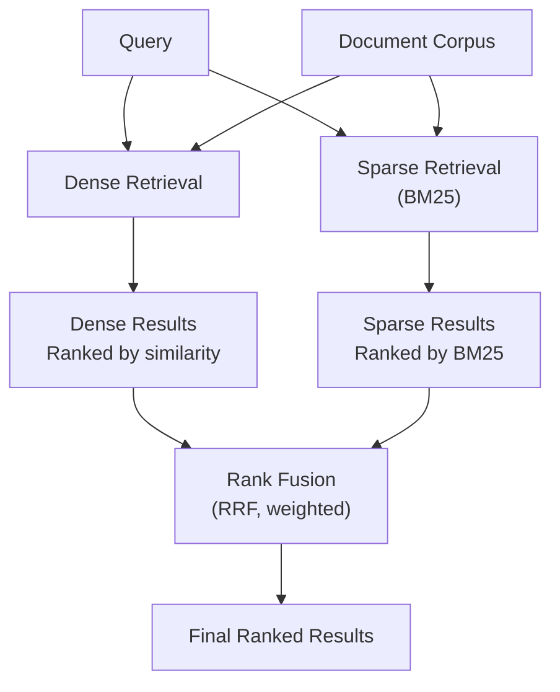

**Category:** RAG (Retrieval Augmented Generation)
**Difficulty:** Intermediate
**Reading time:** 6 min read

---

Hybrid retrieval combines dense semantic and sparse keyword-based methods into a unified pipeline, leveraging the strengths of both approaches. This strategy retrieves documents with both semantic relevance and exact term matching, improving overall coverage and accuracy compared to single-method approaches.

- **Dense retrieval** — semantic embedding-based search for conceptual similarity
- **Sparse retrieval** — keyword-based search for exact term matching
- **Rank fusion** — combining multiple ranked result sets into a single ranking
- **Weight balancing** — tuning contribution of each retrieval method
- **Late fusion** — merging results after independent retrieval runs

Hybrid systems run both dense and sparse retrieval on the same query and corpus in parallel, then apply fusion techniques to merge the result sets. Reciprocal rank fusion (RRF) is a parameter-free approach that assigns scores based on result ranks, giving equal weight to both methods. Alternatively, systems can use weighted combinations where the contribution of dense and sparse results is tuned based on domain or query characteristics. Some implementations score dense and sparse results on the same scale (e.g., normalizing to 0-1 range) before adding them. The query is processed through both dense encoders and keyword indexing, so hybrid systems leverage the dense method's ability to capture synonymy and semantic relationships while preserving the sparse method's sensitivity to exact terminology. This combination is particularly effective for technical domains where both semantic understanding and specific terminology matter. Advanced variants use learned fusion weights or context-aware selection of which method to emphasize for different queries.

- Technical and scientific document retrieval
- Legal and compliance document search
- Multi-domain knowledge bases with varied content types
- Enterprise search systems balancing precision and recall
- Systems requiring both semantic and keyword accuracy

| Advantage | Disadvantage |
|-----------|--------------|
| Balances semantic and keyword strengths | Higher computational cost than single method |
| Improves recall through dual coverage | Requires tuning fusion weights and parameters |
| Handles diverse document types effectively | More complex infrastructure and indexing |
| Mitigates weaknesses of individual methods | Harder to debug and explain results |
| Works well across different domains | Increased latency from parallel retrievals |

- [Dense retrieval](dense-retrieval.md)
- [Sparse retrieval (BM25, TF-IDF)](sparse-retrieval-bm25-tf-idf.md)
- [Reciprocal rank fusion (RRF)](reciprocal-rank-fusion-rrf.md)

---
*Part of the [RAG (Retrieval Augmented Generation)](index.md) category · [Back to Master Index](../../index.md)*
