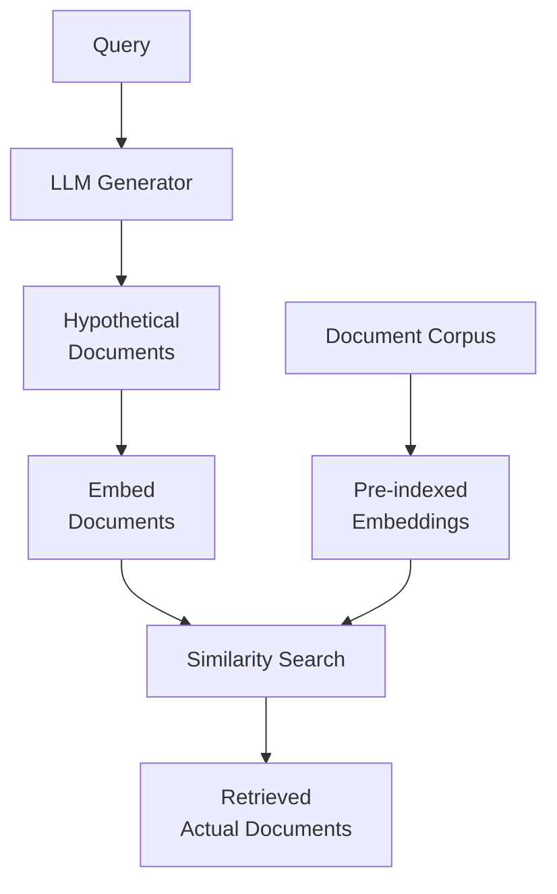

**Category:** RAG (Retrieval Augmented Generation)
**Difficulty:** Intermediate
**Reading time:** 6 min read

---

HyDE (Hypothetical Document Embeddings) uses language models to generate hypothetical documents relevant to a query, then retrieves actual documents similar to these synthetic examples. This approach bridges the vocabulary gap between queries and documents by synthesizing representative document content.

- **Hypothetical document generation** — using LLM to create example documents matching a query
- **Synthetic embeddings** — embeddings of LLM-generated documents rather than queries
- **Vocabulary bridging** — connecting different vocabularies between queries and documents
- **Document-space retrieval** — performing retrieval in document similarity space
- **LLM-as-reasoning** — leveraging language models for semantic understanding

HyDE addresses the query-document mismatch problem by generating synthetic documents that exemplify what a relevant document might look like. When given a query, a language model (like a fine-tuned T5 or GPT) generates one or more hypothetical documents that would answer the query. These synthetic documents are then embedded using the same embedding model used for the corpus. The embedding of the hypothetical document(s) is used as the query embedding in a dense retrieval search, finding actual documents in the corpus that are similar to the synthetic example. Because the hypothetical document was generated in the document space rather than the query space, it often bridges vocabulary gaps and aligns better with actual document language. The approach is particularly effective for queries with limited vocabulary that don't match document terminology well. Variants include using multiple hypothetical documents and aggregating their embeddings, or using different LLMs for generation and ranking.

- Retrieving documents with different vocabulary than the query
- Improving recall on specialized technical queries
- Domains where query and document language diverge significantly
- Open-domain QA systems
- Documents written in formal or domain-specific language

| Advantage | Disadvantage |
|-----------|--------------|
| Bridges query-document vocabulary gaps | Requires LLM calls for each query |
| Works well with diverse corpus vocabularies | Dependent on quality of generated documents |
| Improves recall on difficult queries | Additional latency from generation step |
| Intuitive approach to semantic matching | Requires careful LLM prompting |
| No fine-tuning needed for embedding models | Generated documents may be off-topic |

- [Dense retrieval](dense-retrieval.md)
- [Multi-query retrieval](multi-query-retrieval.md)
- [Retrieval strategies](retrieval-strategies.md)

---
*Part of the [RAG (Retrieval Augmented Generation)](index.md) category · [Back to Master Index](../../index.md)*
