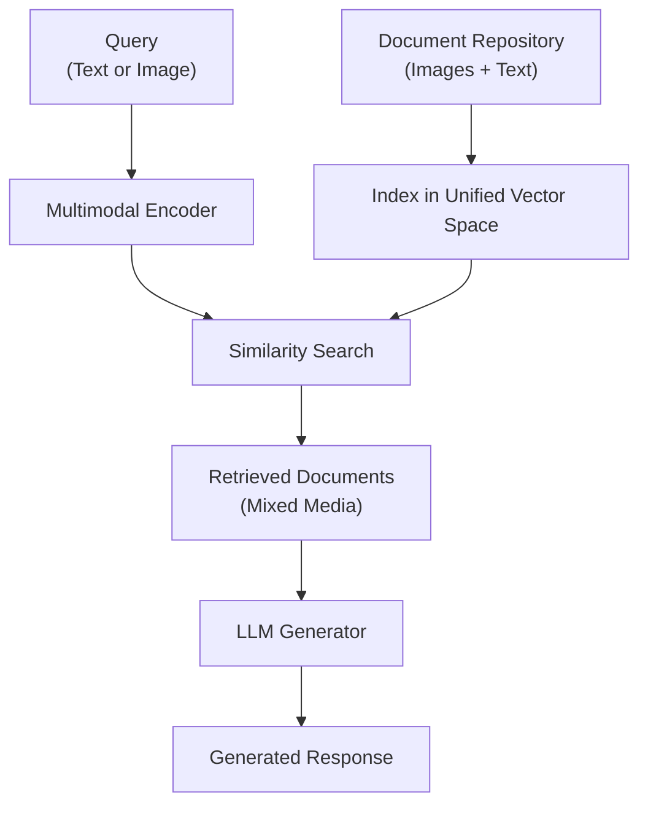

**Category:** RAG (Retrieval Augmented Generation)
**Difficulty:** Intermediate
**Reading time:** 6 min read

---

Image-text multimodal RAG extends retrieval-augmented generation to handle both images and text, enabling systems to retrieve and reason over mixed media documents. This approach enhances contextual understanding by leveraging visual information alongside textual content, crucial for domains with rich visual documentation.

- **Multimodal embeddings** — representations that encode both image and text in a shared vector space
- **Cross-modal retrieval** — finding relevant content regardless of whether query or documents contain images or text
- **Vision-language models** — neural networks trained to understand and generate both visual and textual information
- **Image-to-text conversion** — extracting semantic meaning from images for retrieval matching
- **Unified vector space** — a common embedding space where images and text can be directly compared

Multimodal RAG systems use dual-branch encoders that process images and text through separate pathways before projecting them into a shared embedding space. When a user provides a query (text or image), it's encoded using the appropriate modality-specific encoder, then compared against indexed documents. The system returns the most relevant documents regardless of their media type. These retrieved items are then passed to a language model that can process multimodal context—either by using models with vision capabilities or by converting image content to textual descriptions. The LLM synthesizes information from both images and text to generate accurate, contextually grounded responses. Advanced systems use cross-attention mechanisms to align image and text representations, improving retrieval accuracy when documents contain complementary visual and textual information.

- Technical documentation with diagrams and code
- Medical imaging reports with radiologist notes
- Product catalogs combining images and specifications
- Scientific papers with figures and experimental data
- Architecture blueprints with accompanying specifications

| Advantage | Disadvantage |
|-----------|--------------|
| Leverages visual context for better understanding | Higher computational cost for image encoding |
| Handles complex documents with mixed media | Requires multimodal training data for optimal results |
| Single unified search across heterogeneous content | Image quality affects retrieval performance |
| Supports visual search queries | More complex indexing and infrastructure |
| Improves retrieval for visual-heavy domains | Fewer pre-trained multimodal models vs text-only |

- [Dense retrieval](dense-retrieval.md)
- [Retrieval strategies](retrieval-strategies.md)
- [Cross-encoder reranking](cross-encoder-reranking.md)

---
*Part of the [RAG (Retrieval Augmented Generation)](index.md) category · [Back to Master Index](../../index.md)*
