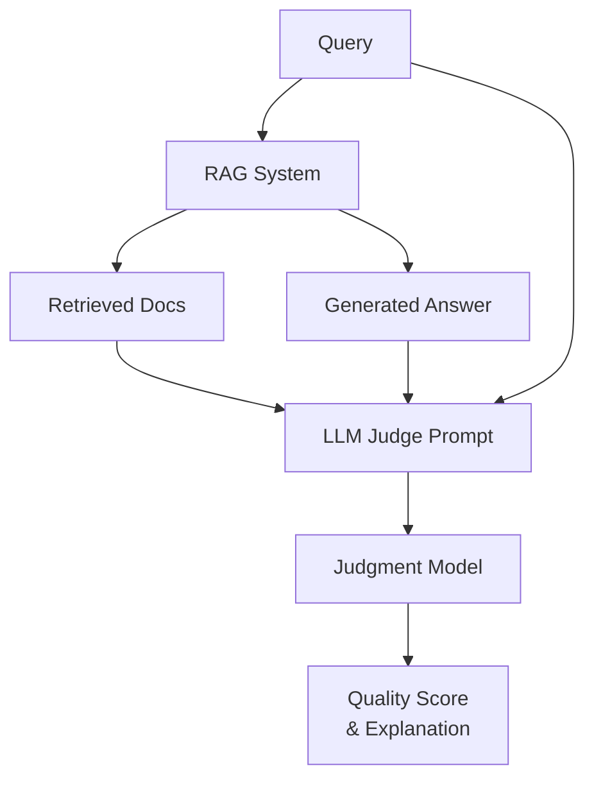

**Category:** RAG (Retrieval Augmented Generation)
**Difficulty:** Intermediate
**Reading time:** 6 min read

---

LLM-as-judge approaches use language models to assess RAG system quality, evaluating dimensions like relevance, faithfulness, and helpfulness. This approach provides scalable, nuanced evaluation without extensive human annotation.

- **Automatic evaluation** — using AI models for assessment
- **Multi-dimensional scoring** — evaluating multiple quality aspects
- **Prompt engineering** — designing effective evaluation prompts
- **Score calibration** — aligning model judgments with human preferences
- **Pairwise ranking** — comparing system outputs rather than absolute scoring

LLM-as-judge evaluation uses a language model to assess RAG system outputs across multiple dimensions. The judge receives the query, retrieved documents, and generated answer, then scores attributes like relevance (how well answer addresses the query), faithfulness (answer alignment with sources), completeness (coverage of important aspects), and clarity (readability and organization). Prompting is critical—detailed rubrics and examples improve consistency. Pairwise comparison approaches ask the model to compare two system outputs and select the better one, often more reliable than absolute scoring. Correlation with human judgment is key for validation; well-designed judges correlate 0.7-0.9 with human evaluation. Advantages include scalability (no human annotation needed), speed (seconds per evaluation), and consistency (no annotator disagreement). Limitations include potential biases from the judge model, vulnerability to prompt injection, and potential gaming where systems learn to fool the evaluator. Multi-judge approaches using different models improve reliability. This approach enables rapid iteration and continuous evaluation in production systems.

- Rapid evaluation during system development
- Continuous monitoring of production RAG systems
- A/B testing different retrieval or generation approaches
- Hyperparameter optimization
- Benchmarking without expensive human annotation

| Advantage | Disadvantage |
|-----------|--------------|
| Scalable and cost-effective | Correlation with human judgment varies |
| Fast feedback enables rapid iteration | Judge biases affect evaluation |
| Consistent evaluation without annotators | Systems can be optimized to fool judges |
| Multiple dimensions evaluable | Requires careful prompt engineering |
| Enables continuous monitoring | Less reliable than human evaluation |

- [RAG evaluation metrics](rag-evaluation-metrics.md)
- [Answer faithfulness](answer-faithfulness.md)
- [Context relevance scoring](context-relevance-scoring.md)

---
*Part of the [RAG (Retrieval Augmented Generation)](index.md) category · [Back to Master Index](../../index.md)*
