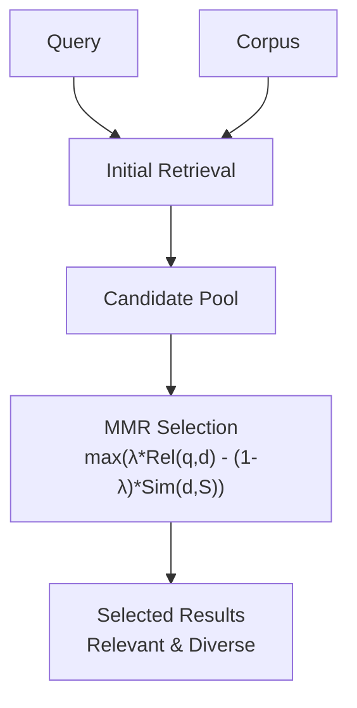

**Category:** RAG (Retrieval Augmented Generation)
**Difficulty:** Intermediate
**Reading time:** 6 min read

---

Maximal Marginal Relevance (MMR) balances relevance and diversity in retrieval results by penalizing documents similar to already-selected items. This approach reduces redundancy and provides more comprehensive coverage of query-relevant topics.

- **Relevance-diversity trade-off** — balancing topical coverage with query match
- **Marginal relevance** — relevance of a document given previously selected ones
- **Similarity penalty** — reducing score for redundant documents
- **Submodular optimization** — greedy selection of diverse relevant items
- **Information content** — maximizing unique information in result sets

MMR is a greedy algorithm that iteratively selects documents balancing relevance to the query and dissimilarity to already-selected documents. For each candidate, MMR computes a score combining two terms: the document's relevance to the query and a penalty based on its maximum similarity to any previously selected document. The trade-off parameter λ (typically 0.5) controls this balance—higher λ emphasizes relevance, lower λ emphasizes diversity. The algorithm starts with the most relevant document, then iteratively selects the document maximizing MMR score until the desired number of results is obtained. This greedy approach avoids selecting multiple documents covering the same topic, instead encouraging the algorithm to branch into different relevant areas. MMR is particularly valuable when result diversity is desirable, such as in question answering where multiple valid answer perspectives should be represented. The computational complexity is manageable, making it suitable for production systems.

- Search results requiring diverse topic coverage
- Question answering where multiple perspectives are valuable
- Information summarization avoiding redundancy
- Exploration-focused applications
- Results where information overlap should be minimized

| Advantage | Disadvantage |
|-----------|--------------|
| Reduces redundancy in results | Greedy approach not globally optimal |
| Improves information coverage | Adds computational complexity |
| Simple and interpretable algorithm | Parameter λ requires tuning |
| Works with any relevance ranking | Diversity metrics are hard to define |
| Effective for exploratory search | May miss highly relevant duplicates |

- [Diversity in retrieval](diversity-in-retrieval.md)
- [Cross-encoder reranking](cross-encoder-reranking.md)
- [Dense retrieval](dense-retrieval.md)

---
*Part of the [RAG (Retrieval Augmented Generation)](index.md) category · [Back to Master Index](../../index.md)*
