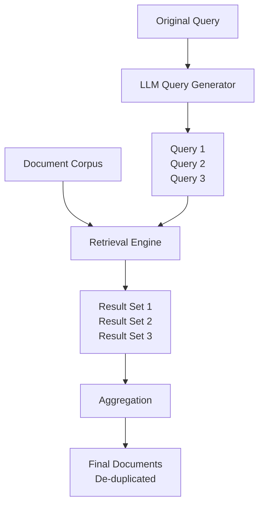

**Category:** RAG (Retrieval Augmented Generation)
**Difficulty:** Intermediate
**Reading time:** 6 min read

---

Multi-query retrieval generates multiple reformulations of a user query and retrieves documents for each variant, aggregating results to improve coverage. This approach addresses the challenge of single-query limitations by exploring different semantic perspectives on the same information need.

- **Query reformulation** — generating alternative phrasings of a query
- **Multi-perspective retrieval** — querying the same corpus from different angles
- **Result aggregation** — merging retrieved documents from multiple queries
- **LLM-guided generation** — using language models to create query variants
- **Query diversity** — ensuring reformulations explore different semantic spaces

Multi-query retrieval addresses the observation that a single query formulation may not capture all relevant documents due to vocabulary variation, perspective differences, or incomplete user expression. An LLM is prompted to generate multiple reformulations of the original query, each capturing different aspects or phrasings. Each reformulated query is executed against the retrieval system independently, producing separate result sets. Results from all queries are then aggregated, typically through deduplication and relevance voting—documents that appear in multiple result sets receive higher scores. This approach is particularly effective for complex questions requiring information from multiple document perspectives. The quality of retrieved documents improves because documents matching different query phrasings are captured, increasing recall. Variants include iterative multi-query approaches where initial results inform subsequent query reformulations, creating a feedback loop that progressively refines retrieval.

- Complex multi-faceted questions requiring diverse information
- Improving recall on conceptually similar but lexically different documents
- Open-domain QA systems
- Research and analytical queries with multiple interpretations
- Systems where single queries consistently miss relevant documents

| Advantage | Disadvantage |
|-----------|--------------|
| Improves recall through diverse query perspectives | Increased retrieval latency from multiple queries |
| Captures documents using different terminology | Higher computational cost for LLM query generation |
| Handles complex, multi-faceted questions well | Potential duplicate results requiring deduplication |
| Reduces sensitivity to query phrasing | Quality depends on LLM's reformulation capability |
| Works with existing retrieval systems | Complexity in aggregating result sets |

- [Query rewriting for RAG](query-rewriting-for-rag.md)
- [Hypothetical document embeddings (HyDE)](hypothetical-document-embeddings-hyde.md)
- [Self-querying retrievers](self-querying-retrievers.md)

---
*Part of the [RAG (Retrieval Augmented Generation)](index.md) category · [Back to Master Index](../../index.md)*
