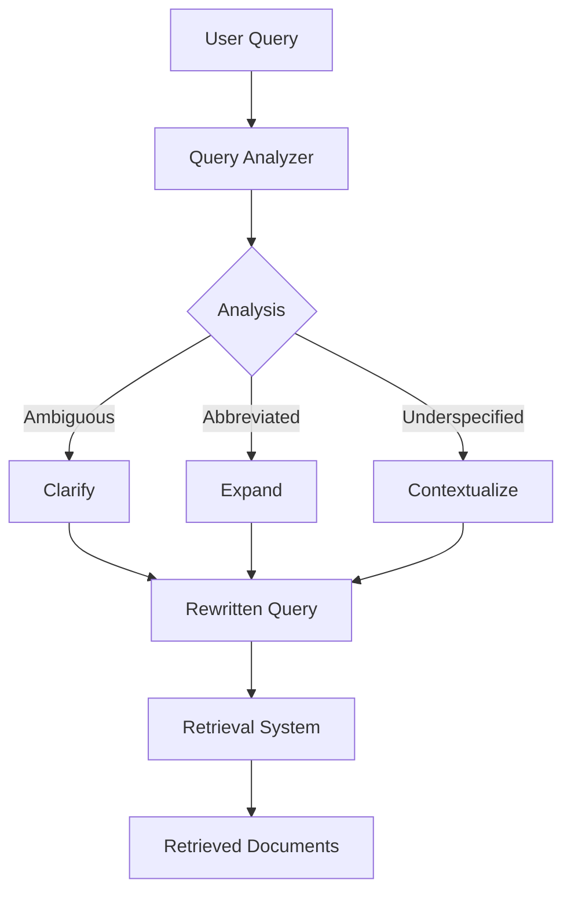

**Category:** RAG (Retrieval Augmented Generation)
**Difficulty:** Intermediate
**Reading time:** 6 min read

---

Query rewriting transforms user queries into optimized forms for better retrieval performance. Techniques include clarifying ambiguous terms, expanding abbreviations, and adjusting queries based on query analysis to maximize matching with relevant documents in the knowledge base.

- **Query expansion** — adding related terms to increase retrieval coverage
- **Query clarification** — resolving ambiguities in the original query
- **Abbreviation expansion** — expanding acronyms and shorthand notation
- **Synonym injection** — incorporating semantic alternatives
- **Context-aware rewriting** — adapting rewrites based on conversation history

Query rewriting systems analyze the original query to identify improvement opportunities. Disambiguation identifies terms with multiple meanings and selects the most likely interpretation based on context or domain knowledge. Expansion adds synonyms, related terms, and query variants that might match documents the original query would miss. Abbreviation expansion converts acronyms to full forms, particularly important in technical domains. Context-aware rewriting considers previous queries and conversation history to understand user intent more accurately. Some systems use language models to generate alternative query formulations, while rule-based systems apply domain-specific rewriting rules. The rewritten query is passed to the retrieval system, which typically has better coverage because the query now matches more document variations. Multi-stage approaches might create several query variants and retrieve with each, then aggregate results. The effectiveness depends on the rewriting strategy's alignment with the knowledge base structure and vocabulary.

- Handling user queries with ambiguous terminology
- Expanding technical acronyms in domain-specific searches
- Improving retrieval for conversational queries
- Adapting queries across different knowledge domains
- Reducing missed relevant documents due to vocabulary gaps

| Advantage | Disadvantage |
|-----------|--------------|
| Improves recall by matching more documents | Risk of incorrect disambiguation |
| Handles domain terminology and abbreviations | Requires domain knowledge for good rewrites |
| Works with existing retrieval systems | Potential query drift from original intent |
| Reduces sensitivity to phrasing variations | Computational cost of rewriting process |
| Particularly effective in specialized domains | Quality varies with rewriting strategy |

- [Multi-query retrieval](multi-query-retrieval.md)
- [Hypothetical document embeddings (HyDE)](hypothetical-document-embeddings-hyde.md)
- [Query expansion and optimization](../related-topic.md)

---
*Part of the [RAG (Retrieval Augmented Generation)](index.md) category · [Back to Master Index](../../index.md)*
