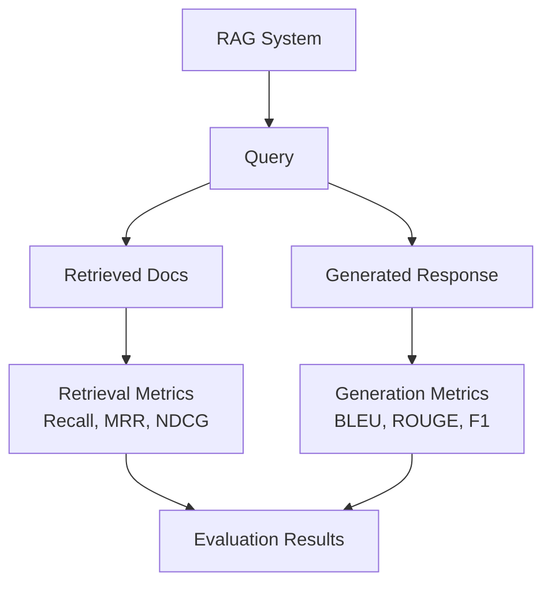

**Category:** RAG (Retrieval Augmented Generation)
**Difficulty:** Intermediate
**Reading time:** 6 min read

---

RAG evaluation metrics measure system performance across retrieval and generation quality. These include retrieval metrics (relevance, coverage) and generation metrics (factuality, helpfulness), providing comprehensive assessment of end-to-end RAG system performance.

- **Retrieval metrics** — assessing document retrieval quality
- **Generation metrics** — evaluating response quality
- **End-to-end metrics** — holistic system performance
- **Benchmark datasets** — standardized evaluation resources
- **Metric correlation** — relationship between metrics and human judgment

RAG systems require evaluation at multiple levels. Retrieval evaluation assesses whether relevant documents appear in retrieved results using metrics like recall (proportion of relevant documents retrieved), mean reciprocal rank (average rank of first relevant document), and NDCG (ranking quality with position weighting). Generation evaluation uses BLEU (lexical overlap), ROUGE (recall-oriented metrics), METEOR (alignment-based), or semantic similarity metrics. End-to-end metrics like EM (exact match) and F1 (token-level overlap) for QA evaluate complete system output. Task-specific metrics exist for different applications—precision/recall for classification, ROUGE for summarization, chrF for translation. Modern evaluation increasingly uses LLM-as-judge approaches where language models assess quality dimensions like factuality and helpfulness. Human evaluation remains the gold standard but is costly. Effective evaluation requires choosing metrics aligned with real user satisfaction and business goals.

- Benchmarking RAG system improvements
- Detecting degradation in production systems
- Comparing different retrieval or generation approaches
- Hyperparameter optimization
- Research and publication reporting

| Advantage | Disadvantage |
|-----------|--------------|
| Comprehensive metrics suite available | No single perfect metric |
| Benchmarks enable standardized comparison | Metrics may not correlate with user satisfaction |
| Automated metrics enable rapid iteration | Requires substantial effort to interpret results |
| Different metrics for different aspects | Task-specific metrics needed |
| Enables reproducibility | Metric gaming and overfitting risk |

- [Context relevance scoring](context-relevance-scoring.md)
- [Answer faithfulness](answer-faithfulness.md)
- [LLM-as-judge for RAG evaluation](llm-as-judge-for-rag-evaluation.md)

---
*Part of the [RAG (Retrieval Augmented Generation)](index.md) category · [Back to Master Index](../../index.md)*
