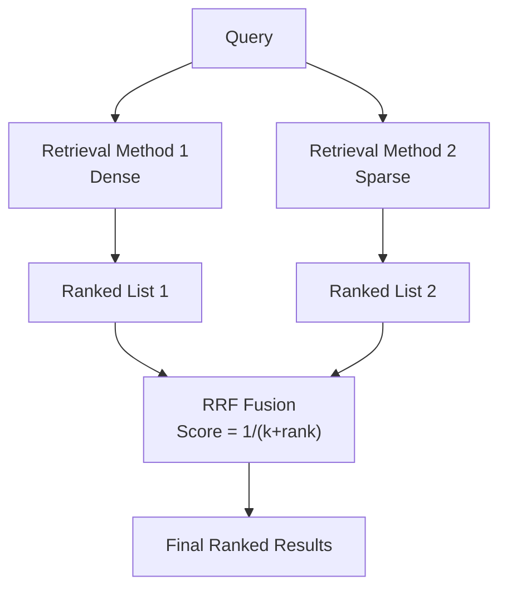

**Category:** RAG (Retrieval Augmented Generation)
**Difficulty:** Intermediate
**Reading time:** 6 min read

---

Reciprocal Rank Fusion is a parameter-free algorithm for combining multiple ranked result lists. It assigns scores based on result rank positions, enabling effective fusion of dense and sparse retrieval or other complementary ranking methods without requiring tuning.

- **Rank fusion** — combining multiple ranked lists into a single ranking
- **Reciprocal ranking** — scoring inversely proportional to rank position
- **Parameter-free algorithm** — no weights or thresholds to tune
- **Redundancy aggregation** — giving higher scores to documents appearing in multiple lists
- **Fusion strategy** — unifying different retrieval method outputs

RRF combines multiple ranked lists by computing a score for each document based on its rank positions across lists. The formula is typically: score = sum(1 / (k + rank)) where k is a constant (commonly 60) and rank is the document's position in a ranking list (starting at 1). Documents appearing only in one list are scored, and documents appearing in multiple lists accumulate scores, typically ranking higher. This approach is parameter-free—the constant k provides a small baseline to avoid division by zero but has minimal tuning impact. RRF effectively balances contributions from different retrieval methods without requiring weight tuning or knowledge of individual method quality. It works particularly well for combining dense and sparse retrieval, where each method has complementary strengths. The method is symmetric and treats all input rankings equally unless modified. RRF is computationally simple, making it efficient for real-time systems.

- Hybrid retrieval combining dense and sparse methods
- Ensemble retrieval combining multiple models
- Fusion of results from different knowledge sources
- Systems where method importance is unknown
- Rapid experimentation with retrieval combinations

| Advantage | Disadvantage |
|-----------|--------------|
| No parameter tuning required | Equal weighting may not be optimal |
| Simple and computationally efficient | Doesn't learn method reliability |
| Parameter-free makes it generalizable | All methods must produce comparable results |
| Works well for method combinations | May underutilize complementary strengths |
| Mathematically principled approach | Sensitive to ranking list length |

- [Hybrid retrieval systems](hybrid-retrieval-systems.md)
- [Dense retrieval](dense-retrieval.md)
- [Sparse retrieval (BM25, TF-IDF)](sparse-retrieval-bm25-tf-idf.md)

---
*Part of the [RAG (Retrieval Augmented Generation)](index.md) category · [Back to Master Index](../../index.md)*
