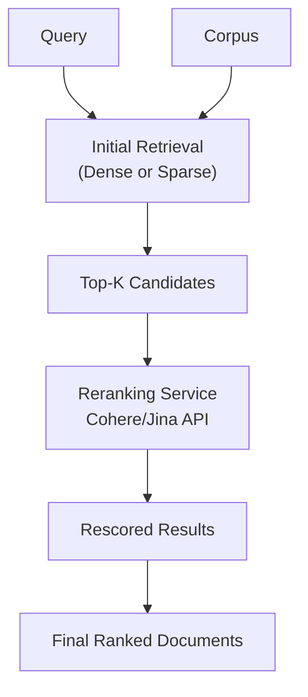

**Category:** RAG (Retrieval Augmented Generation)
**Difficulty:** Intermediate
**Reading time:** 6 min read

---

Reranking models like those from Cohere and Jina score initial retrieval results using more sophisticated cross-encoder models. These specialized services provide highly accurate relevance scoring to improve retrieval quality without retraining models.

- **Cross-encoder scoring** — jointly evaluating query-document pairs
- **Semantic relevance ranking** — assessing contextual match beyond keyword similarity
- **API-based reranking** — using cloud services for specialized scoring
- **Retrieval re-ranking pipeline** — improving initial results with a second-pass scorer
- **Relevance confidence scores** — quantifying match certainty

Reranking services take the top-k candidates from initial retrieval and apply more compute-intensive cross-encoder models that jointly encode the query and each document. These models can capture fine-grained relevance signals that bi-encoder retrieval methods miss. Cohere's rerank API uses specialized models trained on human relevance judgments, providing reliable relevance scores. Jina's reranking leverages its embedding models to score document-query pairs with high precision. The workflow involves submitting the initial retrieval results to the reranking API, which returns relevance scores for each document, then sorting by these new scores. This two-stage approach balances efficiency (fast initial retrieval) with accuracy (precise ranking). Reranking is particularly effective when initial retrieval produces many relevant candidates but they're poorly ranked, or when the initial method's ranking differs from human judgment. The approach is cost-effective because reranking is only applied to a subset of documents rather than the full corpus.

- Improving ranking quality from initial dense or sparse retrieval
- Search systems where ranking accuracy directly impacts user satisfaction
- Production search applications requiring high-quality results
- Reducing false positives in retrieval pipelines
- Specialized domains where domain-specific ranking is needed

| Advantage | Disadvantage |
|-----------|--------------|
| Significantly improves ranking quality | Additional API call cost per query |
| Uses specialized pre-trained models | Increased latency from extra step |
| No training required, ready to use | Dependent on external API availability |
| Works with any initial retrieval method | Quality limited by reranking model capabilities |
| Provides confidence scores | Adds complexity to retrieval pipeline |

- [Cross-encoder reranking](cross-encoder-reranking.md)
- [Dense retrieval](dense-retrieval.md)
- [Reciprocal rank fusion (RRF)](reciprocal-rank-fusion-rrf.md)

---
*Part of the [RAG (Retrieval Augmented Generation)](index.md) category · [Back to Master Index](../../index.md)*
