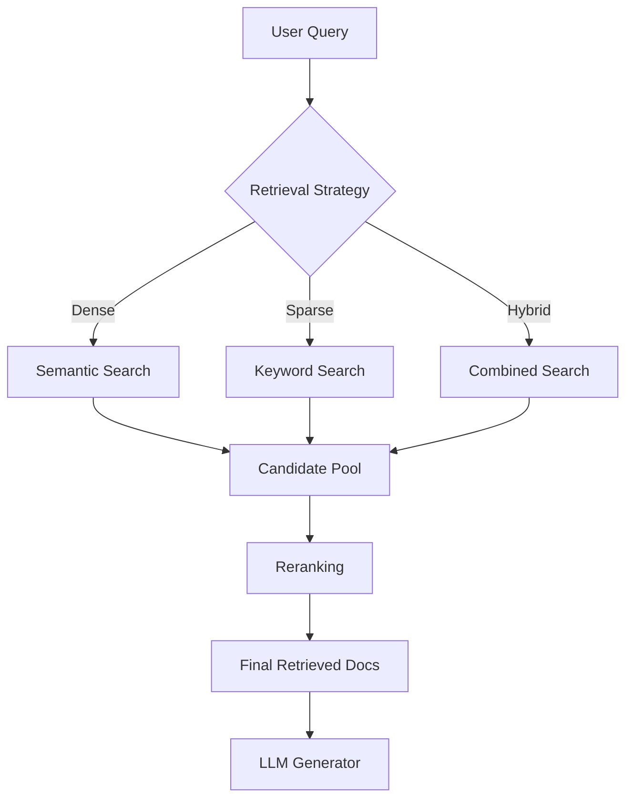

**Category:** RAG (Retrieval Augmented Generation)
**Difficulty:** Intermediate
**Reading time:** 6 min read

---

Retrieval strategies define how systems locate and select relevant documents from knowledge bases to augment LLM generation. Different strategies balance between precision (returning only relevant results) and recall (finding all relevant documents), with trade-offs depending on domain requirements and available computational resources.

- **Dense retrieval** — using semantic embeddings to find similar documents
- **Sparse retrieval** — keyword-based methods like BM25 that match exact terms
- **Hybrid retrieval** — combining dense and sparse methods for improved coverage
- **Multi-hop retrieval** — iteratively retrieving documents to answer complex questions
- **Reranking** — post-processing retrieved results to improve relevance ordering

Different retrieval strategies serve different purposes in RAG pipelines. Dense retrieval converts queries and documents into embeddings using neural models, enabling semantic similarity search even when keywords don't match exactly. Sparse retrieval relies on term frequency and inverted indices, excelling at precision when exact keywords matter. Hybrid approaches combine both methods, typically using fusion techniques like reciprocal rank fusion to merge results. The strategy selection depends on the knowledge domain—structured, technical content benefits from sparse methods, while narrative or semantic-heavy content favors dense retrieval. Multi-hop retrieval handles complex questions by iteratively querying, using initial results to refine subsequent searches. All strategies benefit from reranking stages where a more sophisticated model re-scores candidates, focusing computational budget on the most relevant documents.

- Search-heavy applications requiring fast keyword matching
- Semantic document retrieval for open-domain QA
- Domain-specific retrieval combining exact matches with semantic similarity
- Complex reasoning tasks requiring multiple retrieval rounds
- Real-time systems balancing speed and accuracy

| Advantage | Disadvantage |
|-----------|--------------|
| Dense retrieval captures semantic meaning | Slower and more compute-intensive |
| Sparse retrieval is fast and deterministic | Misses synonyms and rephrased content |
| Hybrid combines benefits of both | Increased complexity and tuning effort |
| Multi-hop handles complex questions | Cumulative latency and error propagation |
| Reranking improves accuracy | Additional model inference cost |

- [Dense retrieval](dense-retrieval.md)
- [Sparse retrieval (BM25, TF-IDF)](sparse-retrieval-bm25-tf-idf.md)
- [Hybrid retrieval systems](hybrid-retrieval-systems.md)

---
*Part of the [RAG (Retrieval Augmented Generation)](index.md) category · [Back to Master Index](../../index.md)*
