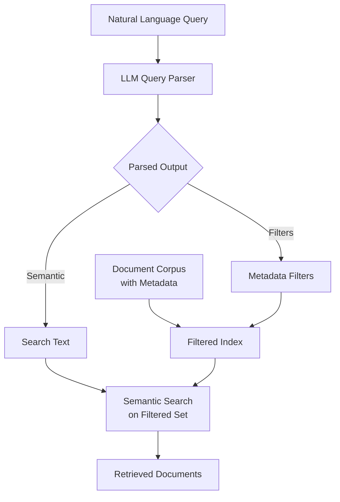

**Category:** RAG (Retrieval Augmented Generation)
**Difficulty:** Intermediate
**Reading time:** 6 min read

---

Self-querying retrievers use language models to parse user queries into structured formats, extracting filters and search parameters. The system automatically decomposes natural language questions into metadata filters and semantic search criteria for more precise document retrieval.

- **Query decomposition** — breaking queries into semantic and filter components
- **Structured query generation** — converting natural language to filter expressions
- **Metadata extraction** — identifying relevant structured attributes from queries
- **Hybrid filtering** — combining semantic search with metadata constraints
- **Schema understanding** — LLM comprehension of database or document schemas

Self-querying retrievers use a language model as a query processor that understands both the user's semantic intent and any filtering constraints mentioned in the query. The LLM is provided with a description of available document metadata fields and is prompted to extract both the semantic search text and any applicable filters (e.g., date ranges, categories, authors). The system then applies the extracted filters to reduce the document search space, followed by semantic search on the filtered subset. This two-stage approach combines the precision of metadata filtering with the flexibility of semantic search. Self-querying is particularly effective for structured data where documents have rich metadata, such as knowledge bases with timestamps, categories, or author information. The approach requires the LLM to understand the query semantics and the database schema simultaneously, which modern language models handle well with appropriate prompting. Advanced implementations use function calling or structured output formats to ensure reliable parsing of metadata constraints.

- Knowledge bases with rich metadata (dates, categories, authors)
- Multi-tenant systems where data is partitioned by user or organization
- Technical documentation with version numbers and categories
- Time-series or temporal queries requiring date filtering
- Domain-specific retrieval where documents have standardized attributes

| Advantage | Disadvantage |
|-----------|--------------|
| Combines semantic and structured retrieval | Requires LLM to understand schema |
| Reduces false positives through filtering | Dependent on accurate filter extraction |
| Leverages metadata for precision | Additional complexity in system design |
| Works with existing documents unchanged | Query parsing failures degrade results |
| Handles complex multi-constraint queries | Needs good schema documentation |

- [Dense retrieval](dense-retrieval.md)
- [Retrieval strategies](retrieval-strategies.md)
- [Contextual compression](contextual-compression.md)

---
*Part of the [RAG (Retrieval Augmented Generation)](index.md) category · [Back to Master Index](../../index.md)*
