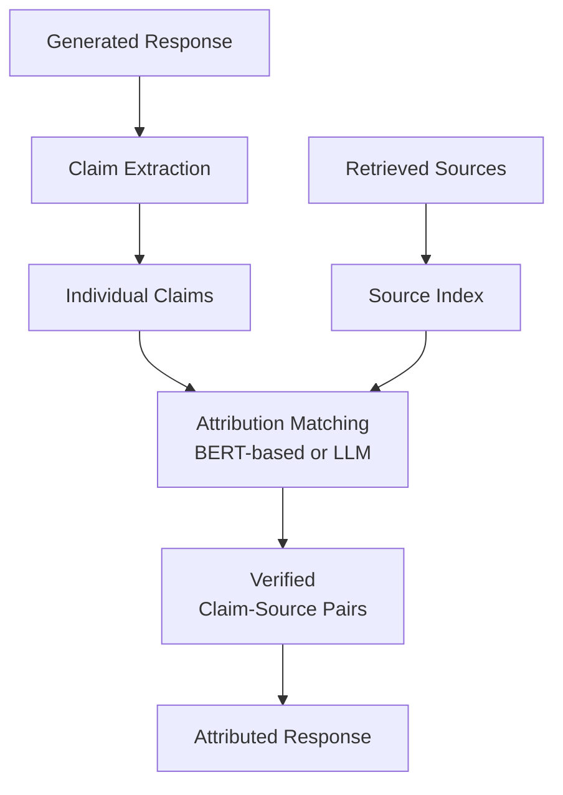

**Category:** RAG (Retrieval Augmented Generation)
**Difficulty:** Intermediate
**Reading time:** 6 min read

---

Source attribution identifies and verifies which documents or passages support specific claims in generated responses. This practice ensures accountability and allows users to verify information directly from authoritative sources.

- **Claim-to-source mapping** — linking statements to their evidence
- **Span attribution** — matching text spans to source locations
- **Evidence verification** — confirming sources actually support claims
- **Attribution accuracy** — measuring correctness of claim-source pairs
- **Provenance tracking** — maintaining complete lineage from source to output

Source attribution processes generated responses by identifying key claims and matching them against retrieved source documents. Methods range from simple keyword matching to sophisticated NLP approaches. LLM-based attribution uses language models to assess whether a document supports a claim, leveraging semantic understanding. Retrieval-augmented approaches re-rank documents by their relevance to specific claims. Fine-grained attribution produces evidence passages for each claim, improving verifiability. The process validates not just that sources were retrieved, but that they actually support the generated content—preventing hallucinations from appearing supported. Advanced systems iteratively refine attributions by retrieving additional documents or using multi-stage models. Quality depends on both the retrieval system (finding truly relevant sources) and the attribution model (correctly matching claims to sources). Measurement typically uses human evaluation or comparison against ground truth claim-source pairs.

- High-stakes information systems requiring verifiability
- Fact-checking and misinformation detection
- Legal and compliance information delivery
- Medical and scientific information systems
- Transparent AI applications building user trust

| Advantage | Disadvantage |
|-----------|--------------|
| Enables verification of generated claims | Adds processing overhead |
| Improves confidence in responses | Requires high-quality source documents |
| Detects and prevents hallucinations | Attribution may miss valid sources |
| Builds user trust through transparency | Computational cost of verification |
| Supports regulatory compliance | Quality depends on attribution model |

- [Citation generation in RAG](citation-generation-in-rag.md)
- [Confidence scoring for retrieved docs](confidence-scoring-for-retrieved-docs.md)
- [Answer faithfulness](answer-faithfulness.md)

---
*Part of the [RAG (Retrieval Augmented Generation)](index.md) category · [Back to Master Index](../../index.md)*
