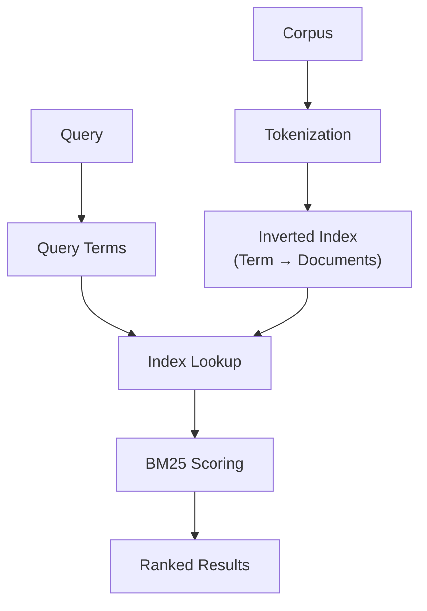

**Category:** RAG (Retrieval Augmented Generation)
**Difficulty:** Intermediate
**Reading time:** 6 min read

---

Sparse retrieval methods like BM25 and TF-IDF use statistical analysis of term frequencies to rank documents. These keyword-based approaches are fast, interpretable, and effective for structured content and exact match scenarios, providing a complementary baseline to modern dense retrieval methods.

- **Term frequency (TF)** — how often a term appears in a document
- **Inverse document frequency (IDF)** — how rare a term is across the corpus
- **BM25** — probabilistic relevance framework improving TF-IDF with saturation curves
- **Inverted index** — data structure mapping terms to document occurrences for fast lookup
- **Query expansion** — adding synonyms or related terms to improve recall

Sparse retrieval systems build inverted indices that map every term in the corpus to the documents containing it. TF-IDF scores each document for a query by computing how frequently each query term appears in the document (TF) multiplied by how rare that term is globally (IDF). BM25 improves on TF-IDF by introducing sublinear term frequency saturation—additional occurrences of a term have diminishing returns—and incorporates document length normalization to prevent bias toward longer documents. The method also includes parameters (k1 and b) that can be tuned for specific domains. Sparse retrieval excels when exact keyword matching matters, such as technical documentation or entity-rich content. The approach scales efficiently to large corpora because term lookups are near-constant time operations. Query expansion techniques further improve recall by automatically adding synonyms or related terms derived from query logs or knowledge bases.

- Full-text search in databases and search engines
- Technical documentation retrieval
- Legal and compliance document search
- First-pass retrieval in hybrid systems
- Domains where keywords are semantically important

| Advantage | Disadvantage |
|-----------|--------------|
| Fast and scalable to large corpora | Misses semantically similar but lexically different terms |
| Interpretable scoring and explainable results | Poor on documents with varied vocabulary |
| Low memory overhead for storage | Sensitive to query formulation and typos |
| Simple to implement and tune | Struggles with synonymy and paraphrasing |
| Works well with structured content | Doesn't capture word order or context |

- [Dense retrieval](dense-retrieval.md)
- [Hybrid retrieval systems](hybrid-retrieval-systems.md)
- [Reciprocal rank fusion (RRF)](reciprocal-rank-fusion-rrf.md)

---
*Part of the [RAG (Retrieval Augmented Generation)](index.md) category · [Back to Master Index](../../index.md)*
