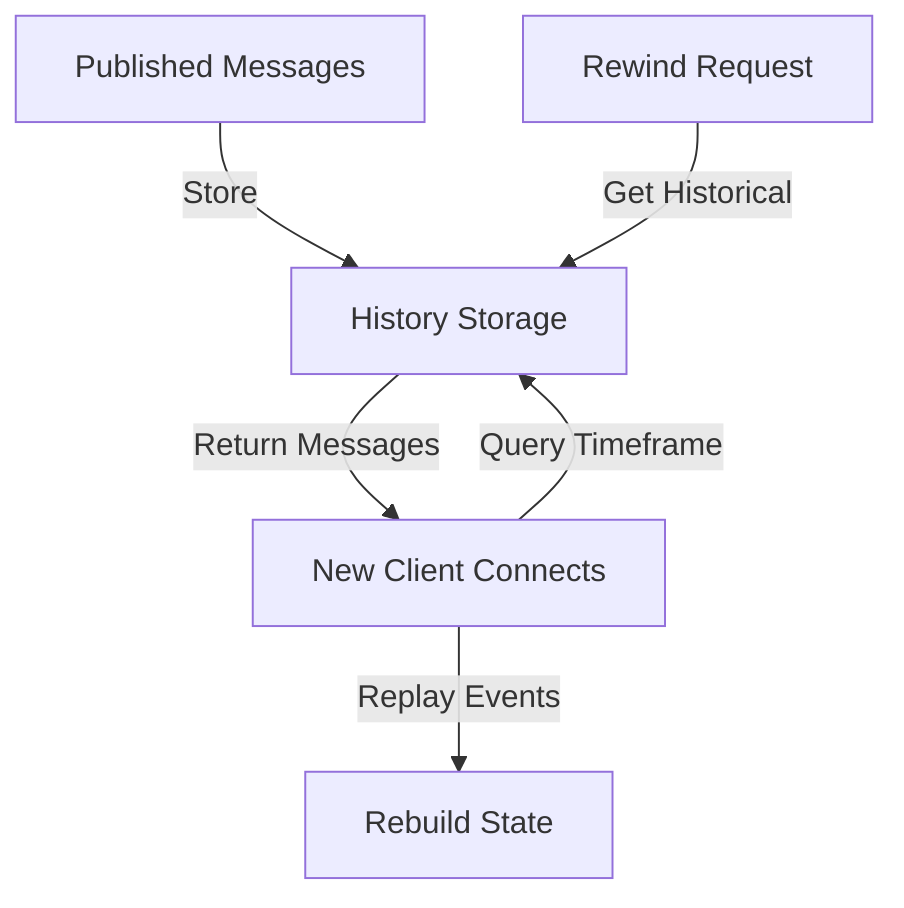

**Category:** Real-time & WebSocket Hosting
**Difficulty:** Intermediate
**Reading time:** 6 min read

---

Ably's history and rewind features enable retrieving past messages within configurable retention windows. This allows new subscribers to catch up on missed events and rebuild application state.

- **Message Retention** — storing published messages for a time period
- **Rewind Query** — retrieving messages from a specific time point
- **Sequence Numbers** — tracking message order with unique identifiers
- **Time Range Queries** — fetching messages within time windows
- **State Reconstruction** — rebuilding state from message history

Ably durably stores published messages in its history backend for configurable retention periods. New subscribers can request messages from a specific sequence number or time to catch up. The rewind feature allows time-based queries, returning messages published during specified windows. Messages include sequence numbers enabling clients to detect gaps or duplicates. State can be reconstructed by replaying message history. Retention policies balance storage costs against historical data availability. Older messages are automatically purged according to retention configuration. The system supports efficient range queries without scanning entire histories.

- Application state synchronization
- Session recovery on reconnection
- Audit trail maintenance
- Event sourcing patterns
- Market data catch-up
- Chat history retrieval
- Transaction replay systems

| Advantage | Disadvantage |
|-----------|--------------|
| Automatic message retention | Storage costs for longer retention |
| Efficient time-range queries | Limited history window |
| State reconstruction enabled | Requires careful schema design |
| No client-side logic needed | Gap detection complexity |
| Reliable catchup for new clients | Message size impacts storage |

- [Message persistence patterns](message-persistence.md)
- [State reconstruction](state-reconstruction.md)
- [Event sourcing architecture](event-sourcing.md)

---
*Part of the [Real-time & WebSocket Hosting](real-time-websocket-hosting/index.md) category · [Back to Master Index](../../index.md)*
