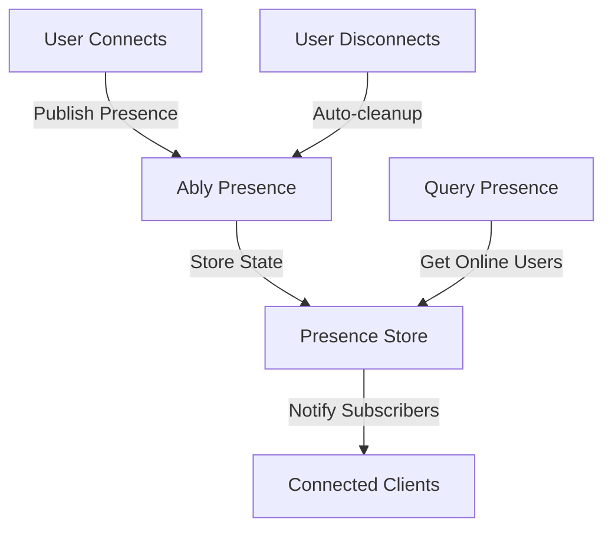

**Category:** Real-time & WebSocket Hosting
**Difficulty:** Intermediate
**Reading time:** 6 min read

---

Ably's presence system provides real-time tracking of connected users and their state information. It automatically manages user lifecycle events and distributes state changes to all interested clients.

- **User State** — metadata associated with each connected user
- **State Changes** — automatic notifications when users join/leave/update
- **Heartbeat** — periodic signals indicating user presence
- **Timestamp Ordering** — temporal consistency of state events
- **Presence Queries** — retrieving current online users

When users connect to a presence channel, Ably registers them with optional state data. State changes trigger notifications to all channel subscribers. Heartbeats maintain connection liveness with automatic cleanup for stale connections. The system ensures temporal ordering of presence events so subscribers see consistent state transitions. Presence metadata can include custom fields like user profiles, location, or activity status. Clients can query current presence lists and receive incremental updates for new joins/leaves. The platform handles network partitions gracefully, eventually achieving consistent state across regions.

- User activity indicators
- Online status tracking
- Collaborative app presence
- Location-based features
- Availability markers
- Real-time user lists
- Chat application presence

| Advantage | Disadvantage |
|-----------|--------------|
| Automatic lifecycle management | Heartbeat overhead for many users |
| Consistent across regions | Eventual consistency delays |
| State change notifications included | Complex state management needs |
| Built-in cleanup | Limited presence metadata size |
| Query historical presence available | Privacy concerns with tracking |

- [User state management](user-state-management.md)
- [Presence protocols](presence-protocols.md)
- [Online status systems](online-status.md)

---
*Part of the [Real-time & WebSocket Hosting](real-time-websocket-hosting/index.md) category · [Back to Master Index](../../index.md)*
