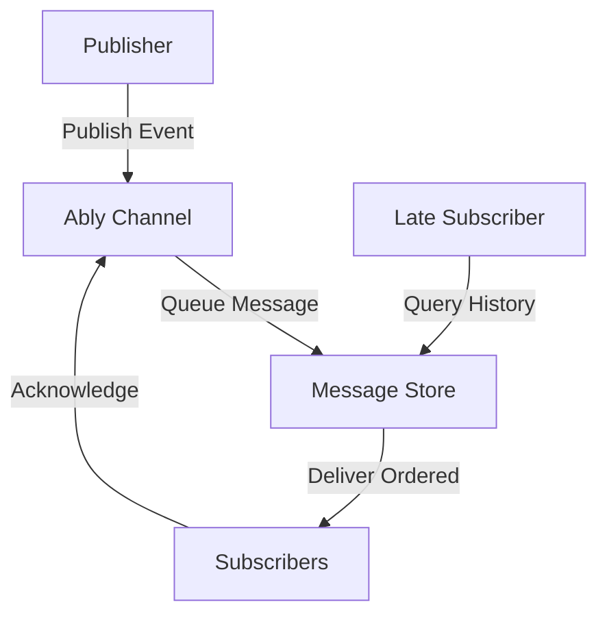

**Category:** Real-time & WebSocket Hosting
**Difficulty:** Intermediate
**Reading time:** 6 min read

---

Ably's pub/sub messaging system provides a reliable publish-subscribe architecture for distributing events across connected clients with guaranteed delivery and message ordering.

- **Publisher** — client or server sending messages
- **Subscriber** — client receiving messages from subscriptions
- **Topic Channels** — named message topics
- **Message Ordering** — guaranteed per-channel ordering
- **Idempotency** — handling duplicate message detection

Publishers send messages to named channels where they are queued durably. Subscribers receive messages in order with idempotent delivery semantics preventing duplicates. The system maintains message ordering per channel, ensuring subscribers see events in publish order. Late-joining subscribers can request message history if configured. Ably handles connection interruptions transparently, delivering queued messages when connections restore. Flow control prevents overwhelming slow subscribers while maintaining ordering guarantees. The platform automatically replicates messages across regions for redundancy.

- Event distribution systems
- Real-time data feeds
- Multi-client synchronization
- Order-critical messaging
- Financial transaction streams
- Operational event pipelines
- Audit trail distribution

| Advantage | Disadvantage |
|-----------|--------------|
| Guaranteed message ordering | Storage requirements for retention |
| Duplicate detection built-in | Complexity versus simple pub/sub |
| Message history queryable | Higher latency than best-effort |
| Flow control prevents backpressure | Requires careful design for high volume |
| Multi-region replication included | Cost increases with message count |

- [Pub/Sub architectures](pub-sub-architectures.md)
- [Message ordering semantics](message-ordering.md)
- [Idempotent messaging](idempotent-messaging.md)

---
*Part of the [Real-time & WebSocket Hosting](real-time-websocket-hosting/index.md) category · [Back to Master Index](../../index.md)*
