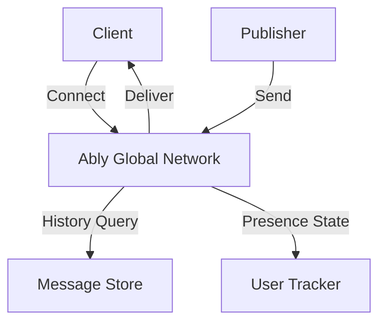

**Category:** Real-time & WebSocket Hosting
**Difficulty:** Intermediate
**Reading time:** 6 min read

---

Ably is an enterprise-grade real-time messaging platform providing guaranteed message delivery, global low-latency connectivity, and built-in presence and history features. It's designed for applications requiring reliability and at-scale performance.

- **Guaranteed Delivery** — at-least-once message delivery guarantees
- **Message History** — ability to replay past messages
- **Presence** — real-time user state and activity tracking
- **Rewind** — retrieve message history across time periods
- **Token Auth** — JWT-based authentication system

Ably maintains globally distributed edge nodes providing low-latency connections. Messages published to channels are stored durably and delivered to subscribers with guaranteed delivery semantics. The platform automatically retries failed deliveries and maintains state for clients reconnecting after disconnection. Presence channels track online users and their metadata with delta compression for efficiency. History retention allows querying past messages within configurable windows. The system uses token-based authentication delegated to backend servers, preventing client-side credential exposure.

- Critical notification systems
- Financial data distribution
- Real-time collaboration
- IoT device communication
- Live sports scoreboards
- Location tracking systems
- Multiplayer gaming infrastructure

| Advantage | Disadvantage |
|-----------|--------------|
| Guaranteed at-least-once delivery | Higher pricing than alternatives |
| Message history and rewind built-in | Complexity for simple use cases |
| Global low-latency infrastructure | Learning curve for enterprise features |
| Strong compliance and security | Vendor lock-in considerations |
| Excellent enterprise support | Overkill for simple chat apps |

- [Message delivery guarantees](message-delivery-guarantees.md)
- [Real-time history storage](real-time-history.md)
- [Enterprise messaging patterns](enterprise-messaging.md)

---
*Part of the [Real-time & WebSocket Hosting](real-time-websocket-hosting/index.md) category · [Back to Master Index](../../index.md)*
