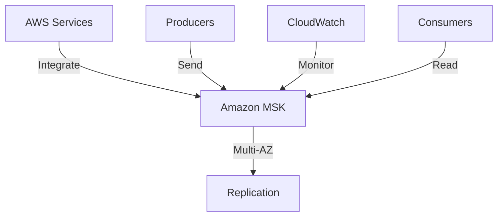

**Category:** Real-time & WebSocket Hosting
**Difficulty:** Intermediate
**Reading time:** 6 min read

---

Amazon MSK is AWS's managed Apache Kafka service providing fully operational Kafka clusters integrated with AWS services. It enables enterprise-scale streaming without cluster management.

- **AWS Integration** — seamless integration with AWS services
- **Auto-Scaling** — automatic topic partition scaling
- **Security** — TLS encryption and IAM integration
- **Monitoring** — CloudWatch integration
- **Replication** — multi-AZ deployment

Amazon MSK provisions and manages Kafka clusters on AWS infrastructure. Multi-AZ deployment provides high availability. Security integrates with VPC, IAM, and encryption services. Auto-scaling adjusts partition count based on traffic. Integration with AWS services like Lambda, S3, and Glue simplifies pipelines. CloudWatch provides monitoring and alerting. Backups are handled automatically. MSK manages cluster patching and updates. Connectivity options include public and private endpoints.

- AWS-native event streaming
- Data lake ingestion
- Real-time analytics pipelines
- Microservice event buses
- Log streaming and processing
- IoT data collection
- Cross-account data sharing

| Advantage | Disadvantage |
|-----------|--------------|
| Seamless AWS integration | AWS lock-in |
| Excellent security features | Pricing comparable to Confluent |
| Auto-scaling capabilities | Less multi-cloud flexibility |
| Good compliance support | Operational still required |
| Well integrated with AWS tools | Learning curve for Kafka |

- [AWS messaging services comparison](aws-messaging.md)
- [Multi-AZ Kafka architecture](kafka-multiaz.md)
- [AWS streaming architectures](aws-streaming.md)

---
*Part of the [Real-time & WebSocket Hosting](real-time-websocket-hosting/index.md) category · [Back to Master Index](../../index.md)*
