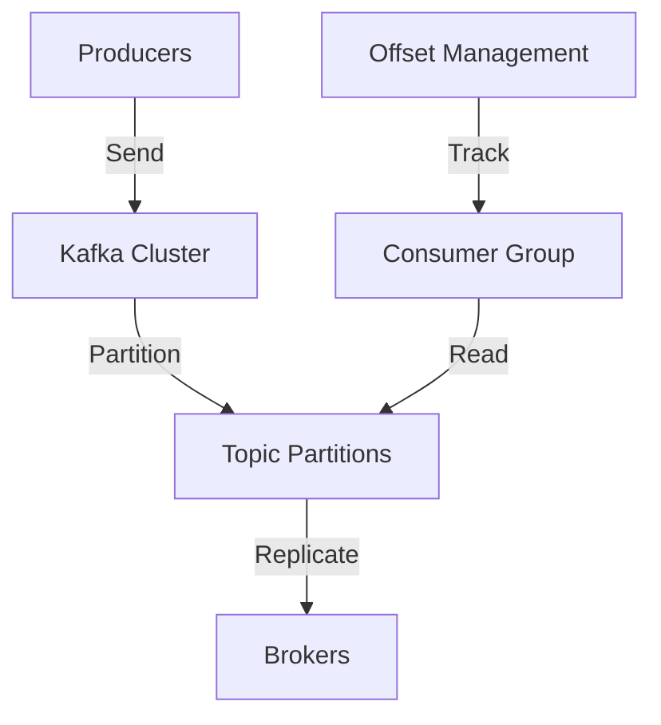

**Category:** Real-time & WebSocket Hosting
**Difficulty:** Intermediate
**Reading time:** 6 min read

---

Apache Kafka is a distributed streaming platform for high-throughput, fault-tolerant data pipelines. Hosted Kafka services manage clusters enabling large-scale event streaming applications.

- **Topics** — partitioned message streams
- **Partitions** — enabling parallelism
- **Consumer Groups** — coordinated message consumption
- **Log Compaction** — maintaining key-value state
- **Exactly-Once Semantics** — delivery guarantees

Kafka brokers form clusters distributing topics across partitions. Each partition is replicated for durability. Producers send events to topics partitioned by key. Consumer groups coordinate reading from partitions ensuring each message is processed once. Kafka maintains offset tracking allowing consumers to pause and resume. Log compaction removes old versions keeping latest state. High throughput design handles millions of events per second. Transactional support ensures exactly-once processing. Stream processing frameworks like Kafka Streams enable real-time analytics.

- Real-time data pipelines
- Event streaming platforms
- Log aggregation and analysis
- Metrics collection systems
- Stream processing applications
- Event sourcing backends
- Data synchronization

| Advantage | Disadvantage |
|-----------|--------------|
| Exceptional throughput | Operational complexity |
| Fault tolerance and durability | High resource requirements |
| Flexible consumer patterns | Learning curve steep |
| Proven at massive scale | Overkill for small scale |
| Rich ecosystem available | Coordination overhead |

- [Event streaming architectures](event-streaming.md)
- [Kafka configuration guide](kafka-config.md)
- [Stream processing platforms](stream-processing.md)

---
*Part of the [Real-time & WebSocket Hosting](real-time-websocket-hosting/index.md) category · [Back to Master Index](../../index.md)*
