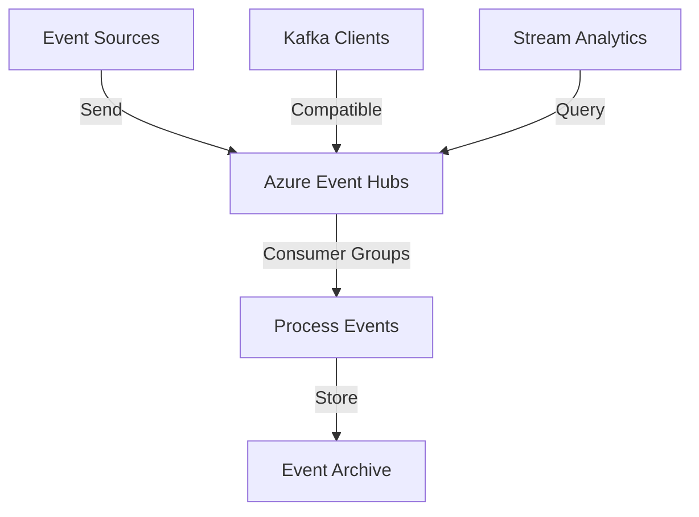

**Category:** Real-time & WebSocket Hosting
**Difficulty:** Intermediate
**Reading time:** 6 min read

---

Azure Event Hubs is Microsoft's managed event streaming service providing Kafka compatibility and enterprise features. It handles massive event ingestion for real-time analytics.

- **Kafka Compatible** — supports Kafka protocol
- **Event Processing** — real-time data pipeline capability
- **Consumer Groups** — coordinated event consumption
- **Throughput Units** — scaling and pricing metric
- **Capture** — automatic archival to storage

Event Hubs ingests events at massive scale with Kafka protocol compatibility. Multiple consumer groups can process the same event stream independently. Throughput units determine throughput and capacity. Events are stored for configurable retention periods. Capture feature archives events to Azure Storage automatically. Integration with Stream Analytics enables real-time queries. Auto-scaling handles traffic fluctuations. Managed service eliminates cluster operations. Strong Azure ecosystem integration simplifies hybrid scenarios.

- Real-time telemetry ingestion
- IoT data collection
- User activity tracking
- Server metric collection
- Event-driven analytics
- Real-time dashboards
- Anomaly detection systems

| Advantage | Disadvantage |
|-----------|--------------|
| Kafka compatible | Azure-centric ecosystem |
| Enterprise feature rich | Throughput unit complexity |
| Automatic scaling | Less flexible than raw Kafka |
| Excellent capture feature | Pricing model differs from others |
| Strong Stream Analytics integration | Smaller ecosystem than Kafka |

- [Azure messaging services](azure-messaging.md)
- [Kafka-compatible platforms](kafka-compatible.md)
- [Real-time analytics platforms](realtime-analytics.md)

---
*Part of the [Real-time & WebSocket Hosting](real-time-websocket-hosting/index.md) category · [Back to Master Index](../../index.md)*
