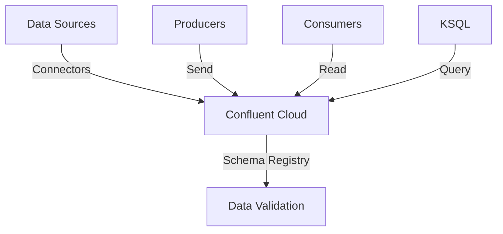

**Category:** Real-time & WebSocket Hosting
**Difficulty:** Intermediate
**Reading time:** 6 min read

---

Confluent Cloud is a managed Kafka service providing fully operational Apache Kafka without infrastructure management. It includes additional features and integrations simplifying Kafka deployment.

- **Fully Managed** — infrastructure handled by Confluent
- **Schema Registry** — managing data schemas
- **Connectors** — integrating external systems
- **Ksql** — streaming SQL queries
- **Multi-Region Replication** — disaster recovery

Confluent Cloud hosts Kafka clusters managed by Confluent. Customers provision clusters with desired throughput and storage. The service handles scaling, updates, and monitoring. Schema Registry manages data format evolution. Connectors integrate with databases, data warehouses, and cloud services. KSQL enables SQL queries on streaming data. Multi-region clusters provide disaster recovery. Confluent provides excellent documentation and support. The managed service eliminates operational burden compared to self-hosted Kafka.

- Enterprise event streaming
- Real-time analytics
- Cloud data pipelines
- Microservice event buses
- Customer data platforms
- IoT data processing
- Financial event systems

| Advantage | Disadvantage |
|-----------|--------------|
| Fully managed, minimal ops | Higher cost than self-hosted |
| Excellent documentation | Vendor lock-in |
| Rich feature set | Less control than self-hosted |
| Good support and SLAs | Pricing based on usage |
| Multi-cloud options | Learning curve for Kafka |

- [Managed Kafka services comparison](managed-kafka-comparison.md)
- [Confluent ecosystem](confluent-ecosystem.md)
- [Schema management strategies](schema-management.md)

---
*Part of the [Real-time & WebSocket Hosting](real-time-websocket-hosting/index.md) category · [Back to Master Index](../../index.md)*
