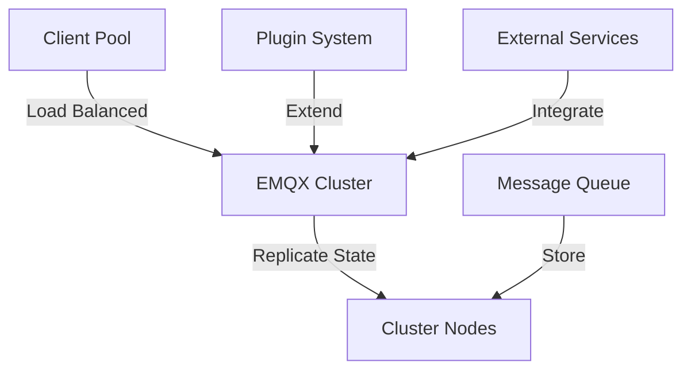

**Category:** Real-time & WebSocket Hosting
**Difficulty:** Intermediate
**Reading time:** 6 min read

---

EMQX is an open-source distributed MQTT broker designed for high scalability and reliability. It provides clustering, enterprise features, and can handle millions of concurrent connections.

- **Distributed Clustering** — multiple nodes sharing load
- **High Throughput** — millions of messages per second
- **Enterprise Features** — monitoring, plugins, integrations
- **Bridge Support** — connecting to other brokers
- **Multi-Protocol** — MQTT, MQTT-SN, and more

EMQX clusters multiple broker nodes sharing connections and message load. Clients can connect to any cluster node with automatic failover. Distributed sessions maintain state consistency across nodes. Message routing uses efficient algorithms for high-throughput scenarios. Built-in persistence stores messages to databases. Plugin architecture allows authentication backends, hooks, and custom logic. Web dashboard provides monitoring and configuration. REST API enables programmatic management. Bridge mode connects to other EMQX clusters or MQTT brokers for federation.

- Large-scale IoT deployments
- Carrier-grade systems
- Industrial IoT networks
- Vehicle telematics
- Smart city infrastructure
- Energy management systems
- Critical infrastructure monitoring

| Advantage | Disadvantage |
|-----------|--------------|
| Excellent horizontal scaling | Complex clustering setup |
| High throughput capabilities | Resource intensive for clusters |
| Strong enterprise features | Requires operational expertise |
| Proven in production | Steeper learning curve |
| Good documentation | Commercial support available |

- [Distributed system architecture](distributed-architecture.md)
- [MQTT at scale](mqtt-scale.md)
- [Broker clustering patterns](broker-clustering.md)

---
*Part of the [Real-time & WebSocket Hosting](real-time-websocket-hosting/index.md) category · [Back to Master Index](../../index.md)*
