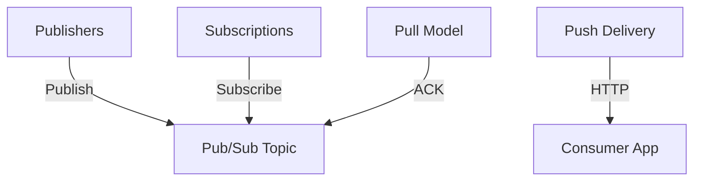

**Category:** Real-time & WebSocket Hosting
**Difficulty:** Intermediate
**Reading time:** 6 min read

---

Google Cloud Pub/Sub is a managed messaging service providing scalable, asynchronous messaging for applications. It integrates with Google Cloud services and enables event-driven architecture patterns.

- **Topics** — named message channels
- **Subscriptions** — consumer endpoints for topics
- **Message Ordering** — per-key ordering guarantees
- **Dead Letter Topics** — handling failed deliveries
- **Push and Pull** — flexible consumption models

Publishers send messages to topics. Subscribers create subscriptions consuming messages. Two consumption modes: push delivery to HTTP endpoints and pull with explicit acknowledgment. Messages are stored durably and delivered with at-least-once guarantee. Dead letter topics handle messages exceeding delivery attempts. Message ordering can be maintained per key. Integration with Cloud Functions, Cloud Run, and dataflow enables serverless event processing. Managed service handles scaling automatically. Strong IAM integration provides fine-grained access control.

- Event-driven application architecture
- Asynchronous task distribution
- Real-time data pipeline integration
- Message-driven microservices
- IoT event aggregation
- Analytics event collection
- Workflow coordination

| Advantage | Disadvantage |
|-----------|--------------|
| Fully managed simplifies operations | Google Cloud lock-in |
| Excellent serverless integration | Less powerful than Kafka for streaming |
| Good throughput and latency | Different semantics than message queues |
| Strong IAM and security | Pricing based on operations |
| Good documentation | Smaller ecosystem than Kafka |

- [Google Cloud messaging services](gcp-messaging.md)
- [Pub/Sub vs Queue patterns](pubsub-queue-patterns.md)
- [Serverless event architectures](serverless-events.md)

---
*Part of the [Real-time & WebSocket Hosting](real-time-websocket-hosting/index.md) category · [Back to Master Index](../../index.md)*
